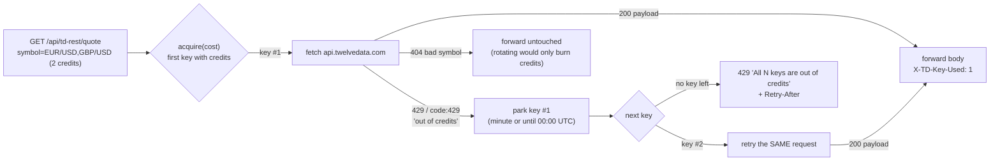
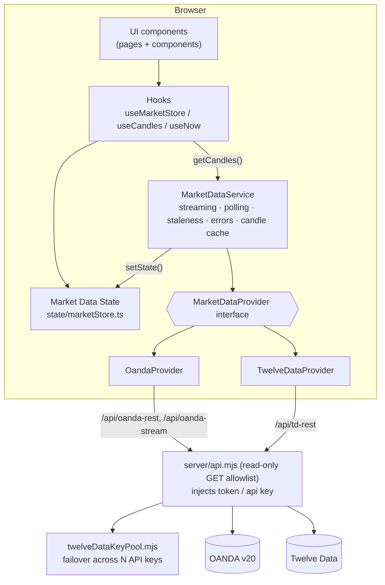
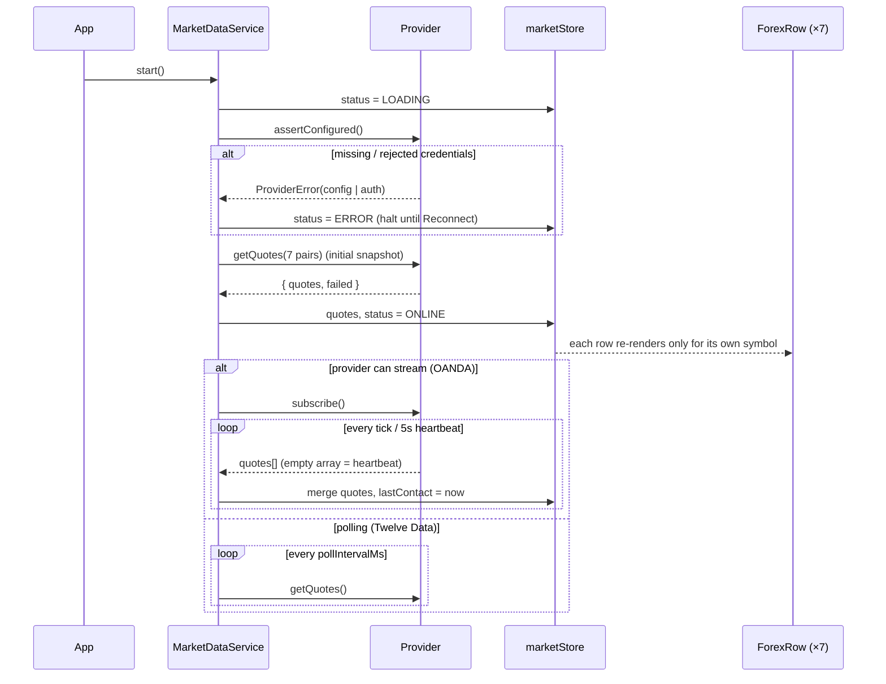
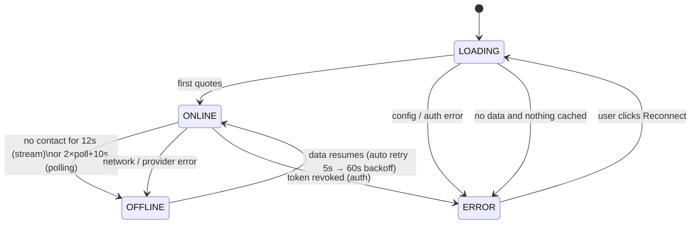
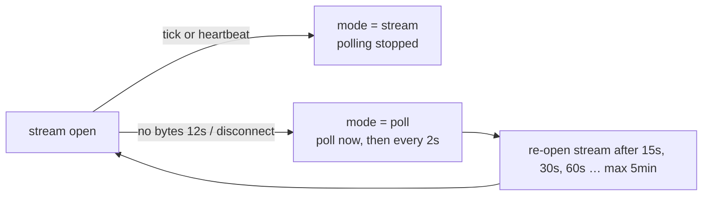
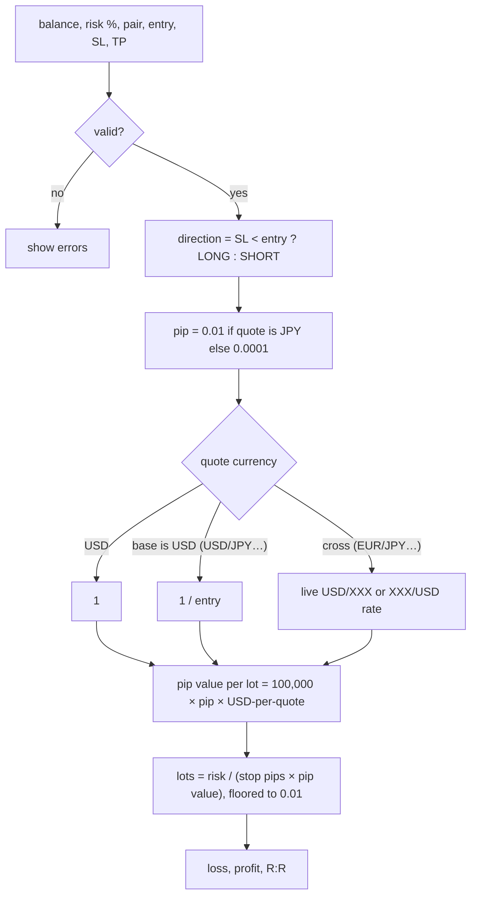
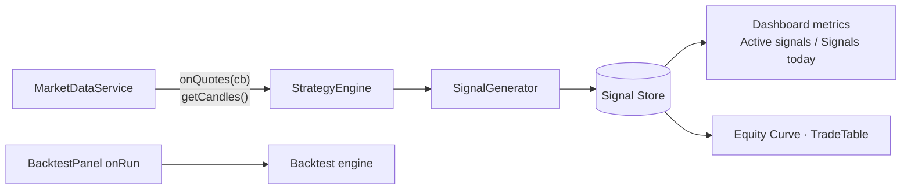

# Ichialgo — Forex terminal (Phase 1)

Phase 1 = **complete UI + real-time Forex market data**.
No strategy, no signals, no backtest engine. Everything performance-related shows empty/zero states.

| Stack | |
|---|---|
| UI | React 19 + TypeScript, React Router 7 |
| Charts | TradingView Lightweight Charts v5 (open-source charting library) |
| Build | Vite 8 |
| Server | `server/api.mjs` read-only market-data proxy (used by dev, preview and `npm start`), with Twelve Data multi-key failover |
| Tests | Vitest (calculator math) |
| Data | OANDA v20 (default) or Twelve Data, behind a provider interface |

---

## 1. Quick start

```bash
npm install
cp .env.example .env      # fill in ONE provider (see below)
npm run dev               # http://localhost:5173
npm test                  # calculator unit tests
npm run build             # typecheck + production bundle
npm start                 # production server: dist/ + proxy on http://127.0.0.1:8080
```

### Option A: OANDA (recommended)
Real bid/ask, real spreads, HTTP streaming. A free **practice** account is enough.

1. Create a practice account at oanda.com, then open *Manage API Access* and generate a token.
2. Find your account ID (format `101-004-XXXXXXX-001`).
3. `.env`:
   ```
   VITE_MARKET_PROVIDER=oanda
   OANDA_API_TOKEN=...
   OANDA_ACCOUNT_ID=...
   OANDA_ENV=practice
   ```

### Option B: Twelve Data
```
VITE_MARKET_PROVIDER=twelvedata
TWELVEDATA_API_KEY=...
VITE_TWELVEDATA_POLL_MS=60000
VITE_TWELVEDATA_CREDITS_PER_MINUTE=8
VITE_TWELVEDATA_CREDITS_PER_DAY=800
```
The free plan allows **8 credits/min and 800 credits/day**, at 1 credit per symbol. With 7 pairs:

| Poll interval | Credits/min | Daily cap lasts |
|---|---|---|
| 60 s | 7 | ~1 h 55 min |
| 5 min | 1.4 | ~9 h 30 min |
| 15 min | 0.47 | ~28 h |

The app meters every request (`providers/creditBudget.ts`). When the per-minute budget is full it waits.
When the daily cap is reached it shows a clear banner and resumes after 00:00 UTC. It never shows stale prices as live.

#### Pooling several Twelve Data keys
Those limits are **per API key**, so one key per Twelve Data account multiplies the budget.
List them in failover order — the proxy serves from the first key that still has credits:
```
TWELVEDATA_API_KEYS=key_account_1,key_account_2,key_account_3
# or, easier to paste into a host dashboard:
TWELVEDATA_API_KEY_1=key_account_1
TWELVEDATA_API_KEY_2=key_account_2
```
Three keys = **24 credits/min, 2400 credits/day** → ~5 h 45 min of 60-second polling instead of ~1 h 55 min.



Two mechanisms, deliberately redundant:

| | What it does | Why |
|---|---|---|
| **Proactive** | counts credits per key (minute window + UTC day) and skips a key it knows is spent | no wasted round-trip |
| **Reactive** | on Twelve Data's own "out of credits", parks the key and **retries the same request** on the next one | the provider is the real authority; also the only thing that works on serverless, where in-memory counters die with each cold start |

A key that answers `401/403` is dropped for the process (a wrong key never fixes itself).
Bad-symbol and upstream 5xx errors are forwarded as-is — they'd fail identically on every key.

`GET /api/td-rest/_status` reports the pool (`{keys, available, perMinuteTotal, perDayTotal, usedToday, pool:[…]}`)
with keys masked to their last 4 chars. `TwelveDataProvider.assertConfigured()` calls it once per session — it costs
no credits — and widens the browser-side meter to the pooled budget. Responses also carry
`X-TD-Key-Used`, `X-TD-Keys-Available` and `X-TD-Credits-Used-Today` for debugging.

> Keys are read server-side only (no `VITE_` prefix) and are never bundled into browser code.
> Pooling free accounts is a budget question, not a bypass: each key keeps its own plan limits and is used within them.

**For a live terminal, use OANDA, or a paid Twelve Data plan with the limits raised in `.env`.**
The REST quote has **no bid/ask**, so those columns show `—`, and "24H change" is vs. the previous daily close.
WebSocket streaming needs the Pro plan; it can be added in `TwelveDataProvider.subscribe()` without UI changes.

> **Restart `npm run dev` after editing `.env`.** Secrets have no `VITE_` prefix, so they stay in the
> Node proxy and are never bundled into browser code.

### Security: the proxy is read-only
An OANDA token can **place orders**. `server/api.mjs` therefore forwards only an allowlist of **GET** endpoints
(account summary, pricing, pricing stream, candles, Twelve Data quote/time_series and the local `_status` report).
Everything else gets `403`/`405`.
That also stops a malicious website from sending a cross-site `POST` to your localhost to open trades.
`npm start` binds to `127.0.0.1`. Don't expose it publicly without authentication in front.

### Why not TradingView for data?
TradingView does not offer a public market-data API for this. We use their **open-source chart library**
for rendering and a real Forex provider for data.

---

## 2. Architecture



Rules enforced by the structure:

- UI **never** imports a provider. It reads `marketStore` and calls `marketDataService`.
- Provider-specific code lives only in `services/marketData/providers/`.
- The factory `providers/index.ts` is the only file that knows concrete providers.

### Folder map

```
src/
  config/        pairs.ts (add pairs here), timeframes.ts, app.ts
  services/marketData/
    types.ts                 provider contract, Quote, Candle, ProviderError
    http.ts                  fetch + timeout + HTTP→error mapping
    MarketDataService.ts     orchestration (the heart of the data layer)
    providers/               OandaProvider, TwelveDataProvider, creditBudget, factory
    index.ts                 singleton + public exports
  state/marketStore.ts       immutable external store (useSyncExternalStore)
  hooks/                     useMarketData, useCandles, useNow
  lib/                       positionSize (+tests), pips, format, time, locale
  components/                Navbar, MetricCard, ForexTable, ForexRow, MarketStatus,
                             PriceChange, PairDetails, CandlestickChart, TimeframeSelector,
                             EmptyState, BacktestPanel, TradeTable, Calculator,
                             ConnectionBanner, KumoMark
  pages/                     Dashboard, PairPage, EquityCurve, Backtest, CalculatorPage
server/
  api.mjs                    read-only GET allowlist + Twelve Data failover handler
  twelveDataKeyPool.mjs      multi-key credit pool (+ tests next to it)
  index.mjs                  production server (dist/ + the same proxy)
api/                         Vercel entry points wrapping server/api.mjs
```

---

## 3. How live data flows



### Connection state machine



**Stale data is never shown as live.** When status is not `ONLINE`, rows are dimmed and tagged
`STALE`, the header shows `● MARKET DATA OFFLINE`, and a banner explains why.
Weekend closures are different: the connection stays `ONLINE` and rows show `CLOSED`.

### Error handling matrix

| Error kind | Example | What the service does | What the user sees |
|---|---|---|---|
| `config` | proxy not running, bad account id | halt | red banner + fix instructions + Reconnect |
| `auth` | 401/403 | halt | "OANDA rejected the API token…" |
| `rate_limit` | 429 / Twelve Data credits | wait `Retry-After` (default 60s) | banner with countdown; OFFLINE if data ages out |
| `network` | timeout, stream stalled | exponential backoff 5s→60s, stream re-open 15s→5min | OFFLINE + STALE rows |
| `invalid_symbol` | pair not offered | drop that pair only (OANDA batch is split to isolate it) | row tagged UNAVAILABLE |
| `no_data` | empty response | retry | ERROR/OFFLINE banner |

### Streaming fallback (OANDA)



### Candles

`useCandles(symbol, timeframe)` loads 300 candles, refreshes every `candleRefreshMs`
(15s OANDA / ≥120s Twelve Data), and patches the **forming** candle's high/low/close with live ticks.
It never creates bars. `CandlestickChart` calls `series.update()` for small changes (keeps the user's zoom)
and `setData()` when the pair or timeframe changes.

**24H change**
- OANDA: first M5 candle at/after *now − 24h* is the reference; cached 5 min per pair.
- Twelve Data: provider's `percent_change` vs. previous daily close (the column header tooltip says so).

---

## 4. Position-size calculator

Pure functions in `src/lib/positionSize.ts`, tested in `positionSize.test.ts`. Account currency is USD.



Worked example (unit test): USD/JPY at 150.00, stop 150.50, $10,000, 1% risk
→ 50 pips, pip value $6.67/lot, **0.30 lots**.

---

## 5. Extending

**Add a pair:** append to `EXTRA_SYMBOLS` in `src/config/pairs.ts`. Nothing else changes.

**Add a provider:**
1. Implement `MarketDataProvider` in `providers/MyProvider.ts` (map symbols, map errors to `ProviderError`).
2. Register it in `providers/index.ts` and add `'myprovider'` to `ProviderId`.
3. Add a read-only route for it in `server/api.mjs` (`routes` array). Dev, preview and production all pick it up.

**Phase 2 hook points (not implemented):**



- `marketDataService.onQuotes(cb)` already emits every live batch.
- `Dashboard.tsx` reads `SIGNALS` from a constant; replace it with the Signal Store.
- `BacktestPanel` already emits a validated `BacktestRequest`.
- `TradeTable` already accepts `TradeRecord[]`.

---

## 6. Production deployment

```bash
npm run build
npm start          # serves dist/ and the proxy; reads .env
```

`server/index.mjs` is a small Express server that uses the **same** proxy module as `npm run dev`.
Configure it with `PORT` and `HOST` in `.env`. Put HTTPS and authentication (nginx, Caddy, Cloudflare Access, a VPN) in front
before exposing it beyond your machine.

If you use your own reverse proxy instead, copy the **GET-only allowlist** from `server/api.mjs`.
Don't use a catch-all `/v3/` rule.

### Testing against a mock provider
`OANDA_REST_URL` and `OANDA_STREAM_URL` override the upstream hosts, for local testing only.
Point them at a mock server that returns OANDA-shaped JSON to exercise LOADING, ONLINE, OFFLINE and ERROR states offline.
