# Ichialgo — Forex terminal

**Live Forex market data, the EMA50 touch strategy with Ichimoku confluence, and ATR-sized
trade plans.** No backtest engine yet; the backtest and equity pages still show empty states.

| Stack | |
|---|---|
| UI | React 19 + TypeScript, React Router 7 |
| Charts | TradingView Lightweight Charts v5 (open-source charting library) |
| Build | Vite 8 |
| Server | `server/api.mjs` read-only market-data proxy (used by dev, preview and `npm start`), with Twelve Data multi-key failover |
| Strategy | EMA50 touch + Ichimoku confluence + ATR trade plans (`src/services/strategy/`) |
| Tests | Vitest (indicators, strategy, proxy, calculator math) |
| Data | OANDA v20 (default) or Twelve Data, behind a provider interface |

---

## 1. Quick start

```bash
npm install
cp .env.example .env      # fill in ONE provider (see below)
npm run dev               # http://localhost:5173
npm test                  # calculator unit tests
npm run build             # typecheck + production bundle
npm start                 # production server: dist/ + proxy on http://127.0.0.1:8080
```

### Option A: OANDA (recommended)
Real bid/ask, real spreads, HTTP streaming. A free **practice** account is enough.

1. Create a practice account at oanda.com, then open *Manage API Access* and generate a token.
2. Find your account ID (format `101-004-XXXXXXX-001`).
3. `.env`:
   ```
   VITE_MARKET_PROVIDER=oanda
   OANDA_API_TOKEN=...
   OANDA_ACCOUNT_ID=...
   OANDA_ENV=practice
   ```

### Option B: Twelve Data
```
VITE_MARKET_PROVIDER=twelvedata
TWELVEDATA_API_KEY=...
VITE_TWELVEDATA_POLL_MS=60000
VITE_TWELVEDATA_CREDITS_PER_MINUTE=8
VITE_TWELVEDATA_CREDITS_PER_DAY=800
```
The free plan allows **8 credits/min and 800 credits/day**, at 1 credit per symbol. With 7 pairs:

| Poll interval | Credits/min | Daily cap lasts |
|---|---|---|
| 60 s | 7 | ~1 h 55 min |
| 5 min | 1.4 | ~9 h 30 min |
| 15 min | 0.47 | ~28 h |

The app meters every request (`providers/creditBudget.ts`). When the per-minute budget is full it waits.
When the daily cap is reached it shows a clear banner and resumes after 00:00 UTC. It never shows stale prices as live.

#### Pooling several Twelve Data keys
Those limits are **per API key**, so one key per Twelve Data account multiplies the budget.
List them in failover order — the proxy serves from the first key that still has credits:
```
TWELVEDATA_API_KEYS=key_account_1,key_account_2,key_account_3
# or, easier to paste into a host dashboard:
TWELVEDATA_API_KEY_1=key_account_1
TWELVEDATA_API_KEY_2=key_account_2
```
Three keys = **24 credits/min, 2400 credits/day** → ~5 h 45 min of 60-second polling instead of ~1 h 55 min.

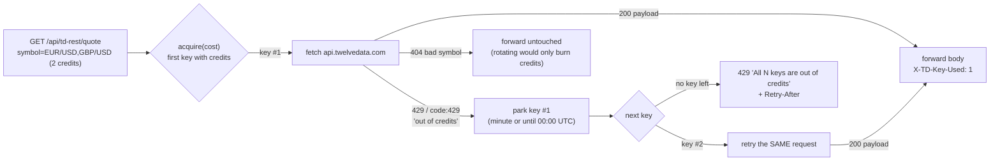

Two mechanisms, deliberately redundant:

| | What it does | Why |
|---|---|---|
| **Proactive** | counts credits per key (minute window + UTC day) and skips a key it knows is spent | no wasted round-trip |
| **Reactive** | on Twelve Data's own "out of credits", parks the key and **retries the same request** on the next one | the provider is the real authority; also the only thing that works on serverless, where in-memory counters die with each cold start |

A key that answers `401/403` is dropped for the process (a wrong key never fixes itself).
Bad-symbol and upstream 5xx errors are forwarded as-is — they'd fail identically on every key.

`GET /api/td-rest/_status` reports the pool (`{keys, available, perMinuteTotal, perDayTotal, usedToday, pool:[…]}`)
with keys masked to their last 4 chars. `TwelveDataProvider.assertConfigured()` calls it once per session — it costs
no credits — and widens the browser-side meter to the pooled budget. Responses also carry
`X-TD-Key-Used`, `X-TD-Keys-Available` and `X-TD-Credits-Used-Today` for debugging.

> Keys are read server-side only (no `VITE_` prefix) and are never bundled into browser code.
> Pooling free accounts is a budget question, not a bypass: each key keeps its own plan limits and is used within them.

**For a live terminal, use OANDA, or a paid Twelve Data plan with the limits raised in `.env`.**
The REST quote has **no bid/ask**, so those columns show `—`, and "24H change" is vs. the previous daily close.
WebSocket streaming needs the Pro plan; it can be added in `TwelveDataProvider.subscribe()` without UI changes.

> **Restart `npm run dev` after editing `.env`.** Secrets have no `VITE_` prefix, so they stay in the
> Node proxy and are never bundled into browser code.

### Security: the proxy is read-only
An OANDA token can **place orders**. `server/api.mjs` therefore forwards only an allowlist of **GET** endpoints
(account summary, pricing, pricing stream, candles, Twelve Data quote/time_series and the local `_status` report).
Everything else gets `403`/`405`.
That also stops a malicious website from sending a cross-site `POST` to your localhost to open trades.
`npm start` binds to `127.0.0.1`. Don't expose it publicly without authentication in front.

### Why not TradingView for data?
TradingView does not offer a public market-data API for this. We use their **open-source chart library**
for rendering and a real Forex provider for data.

---

## 2. Architecture

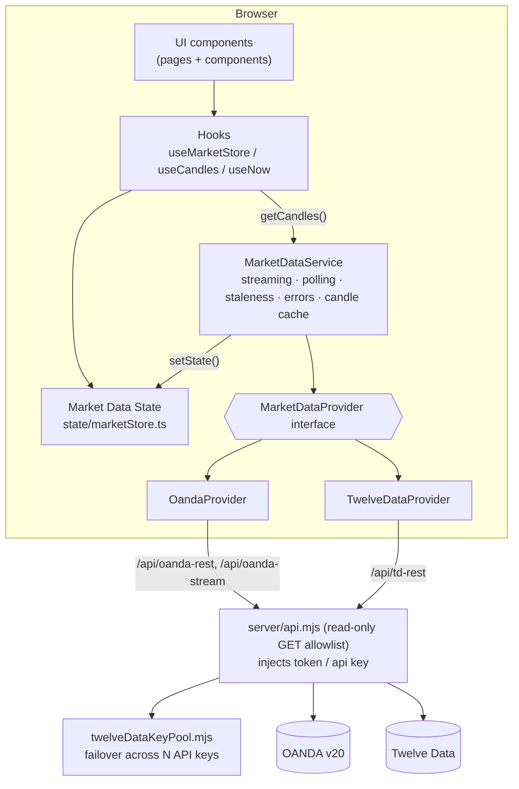

Rules enforced by the structure:

- UI **never** imports a provider. It reads `marketStore` and calls `marketDataService`.
- Provider-specific code lives only in `services/marketData/providers/`.
- The factory `providers/index.ts` is the only file that knows concrete providers.

### Folder map

```
src/
  config/        pairs.ts (add pairs here), timeframes.ts, app.ts, strategy.ts
  services/marketData/
    types.ts                 provider contract, Quote, Candle, ProviderError
    http.ts                  fetch + timeout + HTTP→error mapping
    MarketDataService.ts     orchestration (the heart of the data layer)
    providers/               OandaProvider, TwelveDataProvider, creditBudget, factory
    index.ts                 singleton + public exports
  services/strategy/
    ema50Touch.ts            the detector: candles in, touches out (pure, tested)
    StrategyEngine.ts        scans every pair; live touches from the quote stream
    tradePlan.ts             ATR stop, R target, lot size (pure, tested)
    ichimokuContext.ts       the five confluence checks (pure, tested)
    types.ts                 TouchSignal, WatchLevel
  state/marketStore.ts       immutable external store (useSyncExternalStore)
  state/signalStore.ts       same pattern, for strategy signals
  state/accountStore.ts      balance + risk %, persisted; shared by plans and calculator
  hooks/                     useMarketData, useCandles, useSignals, useNow
  lib/indicators/            ema, atr, ichimoku (+tests)
  lib/                       positionSize (+tests), pips, format, time, locale
  components/                Navbar, MetricCard, ForexTable, ForexRow, MarketStatus,
                             PriceChange, PairDetails, CandlestickChart, TimeframeSelector,
                             EmptyState, BacktestPanel, TradeTable, Calculator,
                             ConnectionBanner, KumoMark, SignalTable, SignalBadge,
                             TradePlanCard, IchimokuTag, IchimokuPanel
  components/chart/          kumoPrimitive (the Kumo fill)
  pages/                     Dashboard, PairPage, EquityCurve, Backtest, CalculatorPage
server/
  api.mjs                    read-only GET allowlist + Twelve Data failover handler
  twelveDataKeyPool.mjs      multi-key credit pool (+ tests next to it)
  index.mjs                  production server (dist/ + the same proxy)
api/                         Vercel entry points wrapping server/api.mjs
```

---

## 3. How live data flows

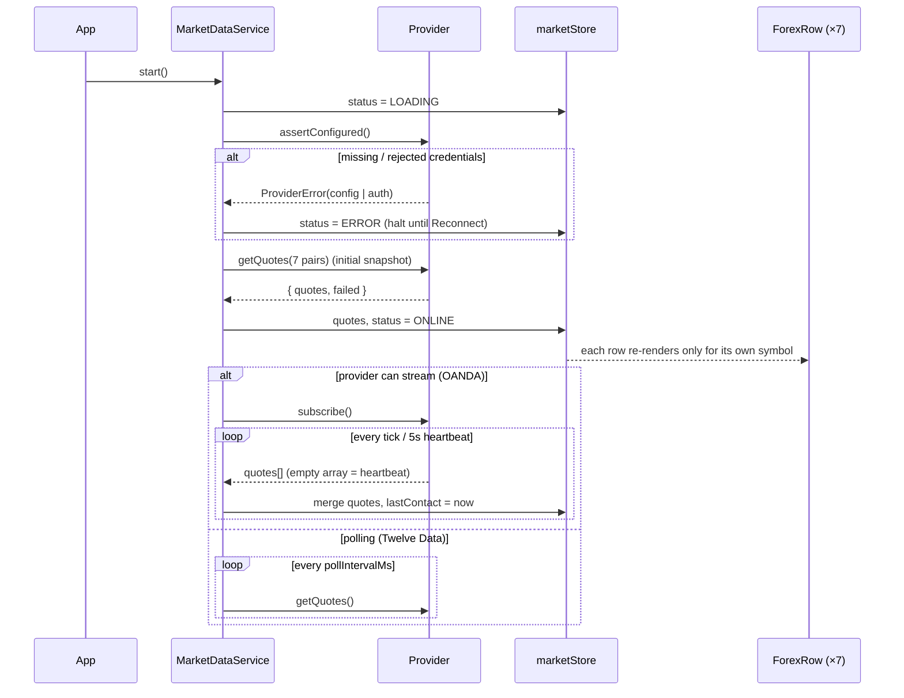

### Connection state machine

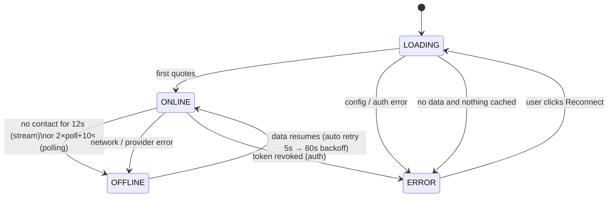

**Stale data is never shown as live.** When status is not `ONLINE`, rows are dimmed and tagged
`STALE`, the header shows `● MARKET DATA OFFLINE`, and a banner explains why.
Weekend closures are different: the connection stays `ONLINE` and rows show `CLOSED`.

### Error handling matrix

| Error kind | Example | What the service does | What the user sees |
|---|---|---|---|
| `config` | proxy not running, bad account id | halt | red banner + fix instructions + Reconnect |
| `auth` | 401/403 | halt | "OANDA rejected the API token…" |
| `rate_limit` | 429 / Twelve Data credits | wait `Retry-After` (default 60s) | banner with countdown; OFFLINE if data ages out |
| `network` | timeout, stream stalled | exponential backoff 5s→60s, stream re-open 15s→5min | OFFLINE + STALE rows |
| `invalid_symbol` | pair not offered | drop that pair only (OANDA batch is split to isolate it) | row tagged UNAVAILABLE |
| `no_data` | empty response | retry | ERROR/OFFLINE banner |

### Streaming fallback (OANDA)

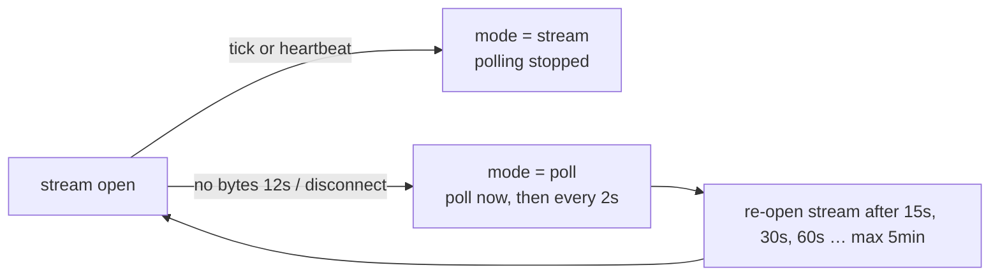

### Candles

`useCandles(symbol, timeframe)` loads 300 candles, refreshes every `candleRefreshMs`
(15s OANDA / ≥120s Twelve Data), and patches the **forming** candle's high/low/close with live ticks.
It never creates bars. `CandlestickChart` calls `series.update()` for small changes (keeps the user's zoom)
and `setData()` when the pair or timeframe changes.

**24H change**
- OANDA: first M5 candle at/after *now − 24h* is the reference; cached 5 min per pair.
- Twelve Data: provider's `percent_change` vs. previous daily close (the column header tooltip says so).

---

## 4. Strategy: EMA50 touch + Ichimoku

Fires when a pair reaches its 50-period EMA on the scanner timeframe.

### What counts as a touch

Price almost never prints the EMA to the last decimal, so a touch is *price entering a band
around the EMA*. The band is **volatility-scaled** — `max(ATR14 × 0.15, 1.5 pips)` — so the
same signal means the same thing in a dead session and a fast one.

```
        high ─┐
              │        ema + tol  ┈┈┈┈┈┈┈┈┈┈┈┈┈┈┈┈┈┈┈
              ├─ bar              ━━━━━ EMA50 ━━━━━━━   band = max(ATR14 × 0.15, 1.5 pips)
              │        ema − tol  ┈┈┈┈┈┈┈┈┈┈┈┈┈┈┈┈┈┈┈
         low ─┘
        touch ⇔ low ≤ ema + tol  AND  high ≥ ema − tol
```

**One signal per approach, not per bar.** A market riding the EMA would otherwise fire on every
single bar, so each pair is armed/disarmed:

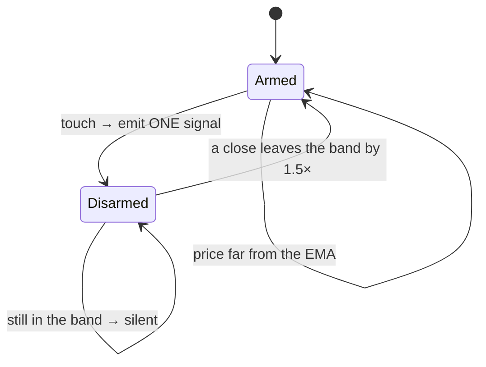

### What each signal tells you

| Field | Meaning |
|---|---|
| **EVENT** | `▲ from above` — price fell back to the EMA · `▼ from below` — price rallied up to it |
| **BIAS** | `LONG` = pullback into a *rising* EMA · `SHORT` = rally into a *falling* EMA · `COUNTER` = the touch fights the EMA's own trend |
| **RESULT** | `BOUNCE` closed back on the approach side (the EMA held) · `CROSS` closed through (it broke) · `INSIDE` closed in the band · `FORMING` bar still open |
| **DIST** | pips between the contact price and the EMA — `0.0` is dead on the line |

Trend is the EMA's own slope over 10 bars (`> 0.15 pips/bar` = trending), not a second average.

### Two detection paths

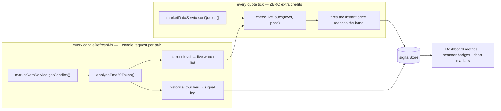

The live path is what makes the signal arrive **the moment** price reaches the level: a 50-period
EMA barely moves inside one bar, so the level from the last scan is watched against the quote
stream that the scanner is already running. No extra provider request, no extra credits.

A signal's id is `(symbol, timeframe, bar)`, so re-scanning never duplicates one — and when the
bar closes, the `candle` result **upgrades** the `live` signal fired earlier on that bar, because
the closed bar is the one that knows whether it bounced or crossed.

### Cost

A scan is **one candle request per pair per `candleRefreshMs`** (free-ish on OANDA, 1 Twelve Data
credit each). It reuses `MarketDataService`'s candle cache, so a pair chart you already have open
is not fetched twice. On Twelve Data's free single-key plan this roughly doubles credit use —
pool several keys (see above) or raise `VITE_TWELVEDATA_POLL_MS`.

### From touch to order ticket

Every signal carries the ATR at the touch, so it can be turned into a sized trade:

```
                     ┌──── take profit   entry + 2R
        LONG         │
   (touch from       ●──── entry = the EMA50 itself
    above, EMA       │
    rising)          └──── stop   entry − 1.5 × ATR   (floor: 8 pips)
```

The stop is ATR-based for the same reason the touch band is: the wick that tagged the EMA is
itself roughly one ATR long, so a fixed stop gets taken out by ordinary noise in a fast market
and is needlessly wide in a quiet one.

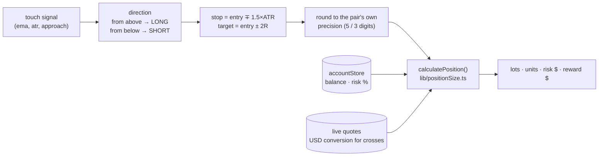

Prices are rounded **before** sizing — you cannot place an order at 1.1015183, and sizing off the
raw float would make the plan disagree with the calculator it prefills.

Sizing is the same `lib/positionSize.ts` the calculator uses, so a plan and a hand-typed
calculation agree to the cent. Balance and risk % live in `accountStore` (persisted to
localStorage), set on the **Calculator** page; the `SIZE` column in the signal table and the
**Trade plan** card on the pair page both read them. "Open in calculator" prefills the form
via `?symbol=&entry=&sl=&tp=` so a signal can be adjusted before it is taken.

A counter-trend touch still gets a plan — it is a worse trade, not an impossible one — with the
reason listed in the card's warnings.

### Ichimoku confluence

The touch says **where**. Ichimoku says whether the rest of the picture agrees. Five checks, each
read in the direction the touch implies — the same bar scores differently for a long and a short:

| # | Check | Passes for a LONG when |
|---|---|---|
| 1 | **Kumo side** | price is above the cloud (below it for a short) |
| 2 | **Cloud colour** | Senkou A is above Senkou B (bullish cloud) |
| 3 | **Tenkan / Kijun** | the conversion line is above the base line |
| 4 | **Chikou free** | the lagging line is clear of the candles 26 bars back |
| 5 | **Kijun overlap** | the EMA50 is within 5 pips of Kijun-sen |

Check 5 is the one worth waiting for: two independent methods marking the *same* level.
It shows as a `K` badge on the score tag.

```
                 ╱▔▔▔╲            price above a rising bullish cloud,
         ────────       ╲___      EMA50 sitting on Kijun
     ━━━━━ EMA50 ≈ Kijun ━━━━━    → a long touch with 5/5 agreement
     ░░░░░░░░ Kumo ░░░░░░░░░░░
```

Signals are **annotated, never hidden** — a 0/5 touch is still logged and flagged, and the
dashboard has an "Ichimoku confluent only" filter (off by default) so a weak setup can be
judged rather than silently dropped. `agrees` means `score ≥ 3`, set by
`ICHIMOKU_CONFLUENCE.agreeThreshold`.

#### Displacement, which is the easy thing to get wrong

```
   Tenkan-sen  (9)   = (highest high + lowest low) / 2
   Kijun-sen  (26)   = same over 26
   Senkou A          = (Tenkan + Kijun) / 2   plotted 26 bars AHEAD
   Senkou B   (52)   = same over 52           plotted 26 bars AHEAD
   Chikou     (26)   = close                  plotted 26 bars BEHIND
```

The cloud above bar `i` was computed 26 bars *earlier*; the cloud computed at bar `i` is drawn
26 bars into the future, past the last candle. `lib/indicators/ichimoku.ts` therefore returns
both, and names them apart so a caller cannot mix them up:

```
   bars:      … 24  25  26  27 …          n-1 │ future (no candles yet)
   senkouARaw:     A25 A26 A27            An-1│              ← computed at bar i
   senkouA:         …  A0  A1             An-27              ← in effect at bar i
   futureCloud():                             │ An-26 … An-1 ← the leading cloud
```

Analysis uses `senkouA` / `senkouB` (in effect). The chart plots those over the candles and
appends `futureCloud()` beyond them.

#### Drawing the cloud

Lightweight Charts has no band series, so the two spans are ordinary line series and
`components/chart/kumoPrimitive.ts` — an `ISeriesPrimitive` — fills between them at
`zOrder: 'bottom'`, behind the candles:

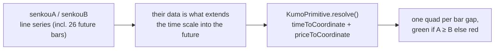

`timeToCoordinate` only resolves times the time scale knows about, which is why the spans must
be real series — without their future points the leading cloud cannot be drawn at all. The fill
is built per bar gap and coloured by the sign of A − B on that gap, so a crossing costs at most
one bar of colour imprecision and needs no intersection maths.

The overlay (Tenkan, Kijun, both spans, Chikou, the fill) toggles off from the chart header.

### Tuning

Everything lives in `src/config/strategy.ts`:

| Setting | Default | Effect |
|---|---|---|
| `period` | 50 | the average being touched |
| `atrMultiple` / `minTolerancePips` | 0.15 / 1.5 | how wide the touch band is |
| `rearmBands` | 1.5 | how far price must leave before the pair can signal again |
| `slopeLookback` / `trendSlopePips` | 10 / 0.15 | when the EMA counts as trending |
| `stopAtrMultiple` / `rewardMultiple` | 1.5 / 2 | where the trade plan's stop and target sit |
| `minStopPips` | 8 | floor on the stop when ATR collapses |
| `kijunConfluencePips` | 5 | how close EMA50 and Kijun must be to count as one level |
| `agreeThreshold` | 3 | Ichimoku checks needed before a touch counts as confluent |

The detector (`services/strategy/ema50Touch.ts`) is pure — candles in, signals out — so it is
directly reusable by a backtest engine later.

## 5. Position-size calculator

Pure functions in `src/lib/positionSize.ts`, tested in `positionSize.test.ts`. Account currency is USD.

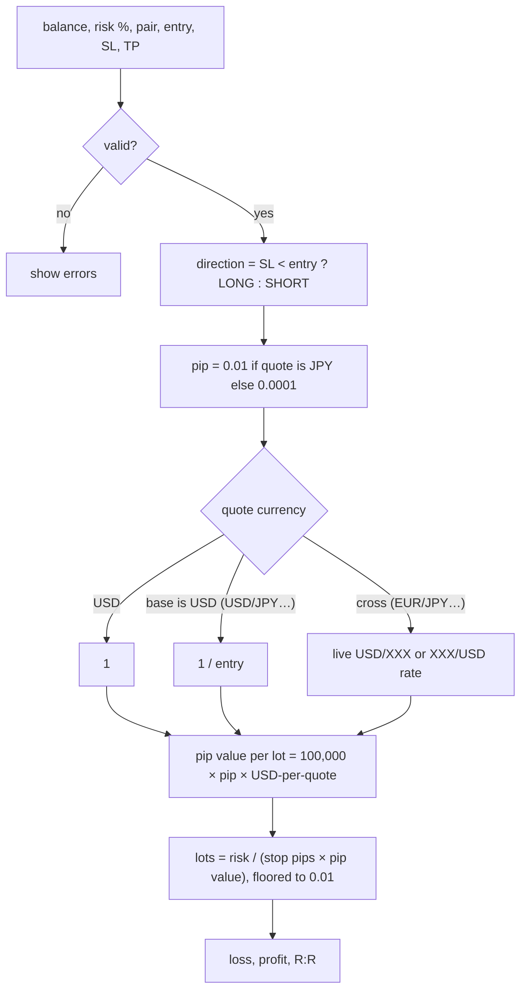

Worked example (unit test): USD/JPY at 150.00, stop 150.50, $10,000, 1% risk
→ 50 pips, pip value $6.67/lot, **0.30 lots**.

---

## 6. Extending

**Add a pair:** append to `EXTRA_SYMBOLS` in `src/config/pairs.ts`. Nothing else changes.

**Add a provider:**
1. Implement `MarketDataProvider` in `providers/MyProvider.ts` (map symbols, map errors to `ProviderError`).
2. Register it in `providers/index.ts` and add `'myprovider'` to `ProviderId`.
3. Add a read-only route for it in `server/api.mjs` (`routes` array). Dev, preview and production all pick it up.

**Add a strategy:** the EMA50 touch detector is the template. Write a pure
`analyse(candles, symbol, timeframe) → signals` function, call it from `StrategyEngine.scan()`,
and give its signals a `strategy` id. The store, table, badges and chart markers are generic.

**What is wired, and what is not:**

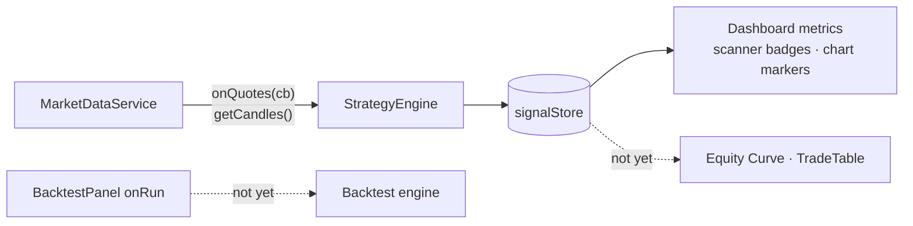

- `marketDataService.onQuotes(cb)` emits every live batch — the engine uses it.
- `BacktestPanel` already emits a validated `BacktestRequest`; nothing consumes it yet.
- `TradeTable` already accepts `TradeRecord[]`; the strategy does not produce trades, only signals.

---

## 7. Production deployment

```bash
npm run build
npm start          # serves dist/ and the proxy; reads .env
```

`server/index.mjs` is a small Express server that uses the **same** proxy module as `npm run dev`.
Configure it with `PORT` and `HOST` in `.env`. Put HTTPS and authentication (nginx, Caddy, Cloudflare Access, a VPN) in front
before exposing it beyond your machine.

If you use your own reverse proxy instead, copy the **GET-only allowlist** from `server/api.mjs`.
Don't use a catch-all `/v3/` rule.

### Testing against a mock provider
`OANDA_REST_URL` and `OANDA_STREAM_URL` override the upstream hosts, for local testing only.
Point them at a mock server that returns OANDA-shaped JSON to exercise LOADING, ONLINE, OFFLINE and ERROR states offline.
