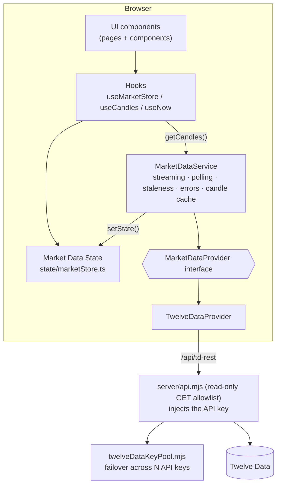
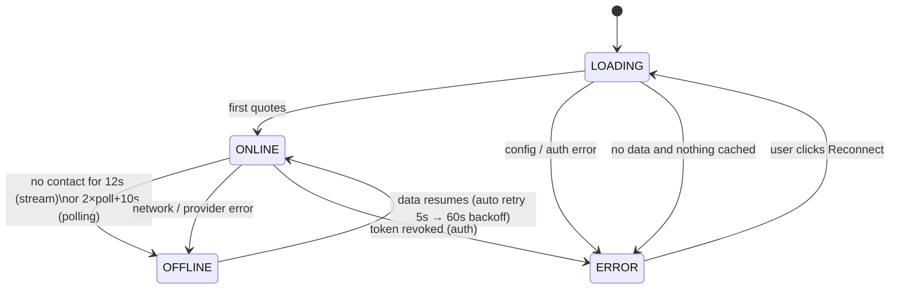
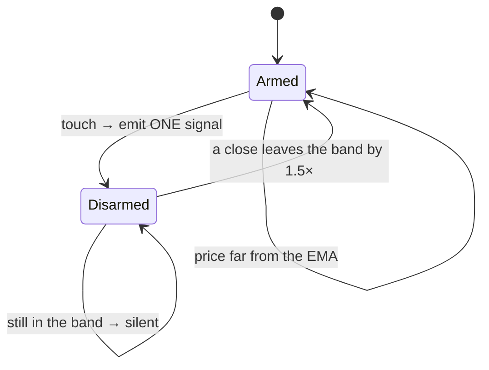
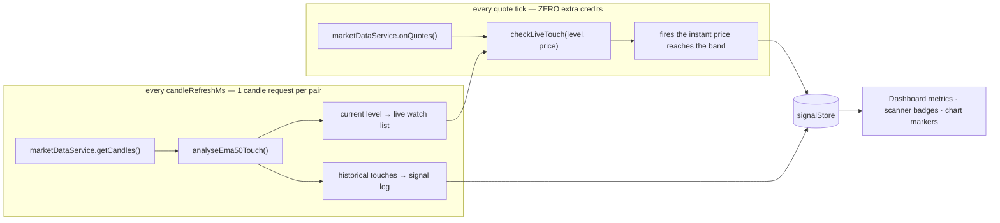
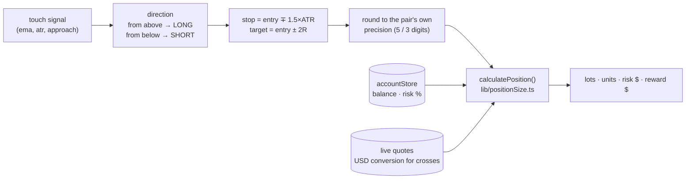
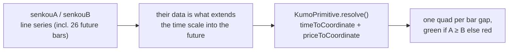
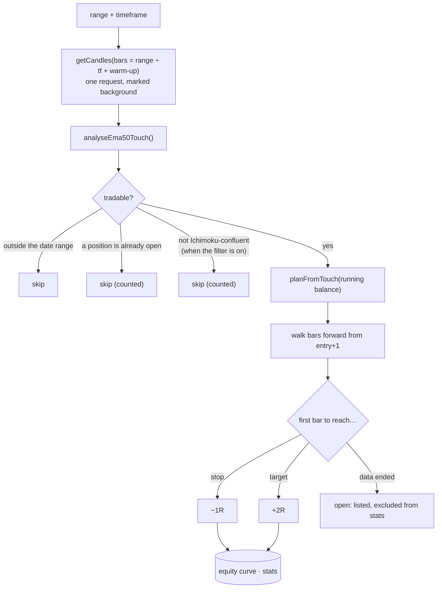
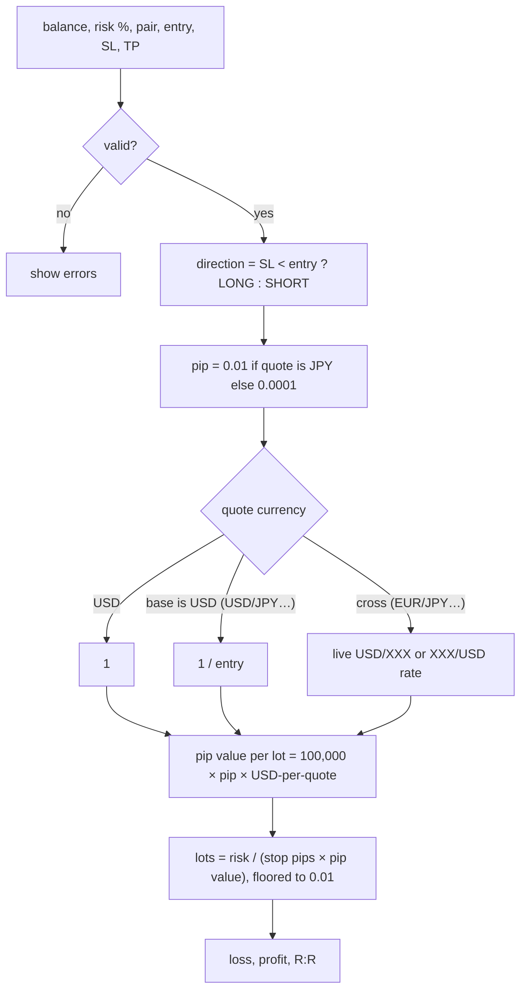
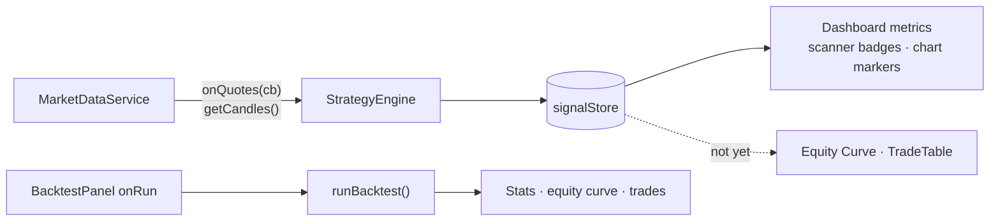

# Ichialgo — Forex terminal

**Live Forex market data, the EMA50 touch strategy with Ichimoku confluence, ATR-sized trade
plans, and a backtest engine that runs the same detector over history.**

| Stack | |
|---|---|
| UI | React 19 + TypeScript, React Router 7 |
| Charts | TradingView Lightweight Charts v5 (open-source charting library) |
| Build | Vite 8 |
| Server | `server/api.mjs` read-only market-data proxy (used by dev, preview and `npm start`), with Twelve Data multi-key failover |
| Strategy | EMA50 touch + Ichimoku confluence + ATR trade plans + backtest (`src/services/strategy/`) |
| Tests | Vitest (indicators, strategy, proxy, calculator math) |
| Data | Twelve Data, behind a provider interface |

---

## 1. Quick start

```bash
npm install
cp .env.example .env      # fill in ONE provider (see below)
npm run dev               # http://localhost:5173
npm test                  # calculator unit tests
npm run build             # typecheck + production bundle
npm start                 # production server: dist/ + proxy on http://127.0.0.1:8080
```

### Twelve Data keys

Twelve Data is the only provider. It is the one free forex source that serves intraday OHLC
candles **to a server, from any country, without a broker account** — OANDA is licensed per
country, Finnhub puts forex candles behind a paid plan, and Yahoo's unofficial endpoint blocks
datacenter IPs, so none of them work from a cloud host.

```
TWELVEDATA_API_KEY_1=key_from_account_1
TWELVEDATA_API_KEY_2=key_from_account_2
TWELVEDATA_API_KEY_3=key_from_account_3
TWELVEDATA_API_KEY_4=key_from_account_4
TWELVEDATA_API_KEY_5=key_from_account_5
```

One key per Twelve Data account; the numbering is the **failover order**. `TWELVEDATA_API_KEYS`
(comma-separated) and a single `TWELVEDATA_API_KEY` also work and can be mixed — see
`server/twelveDataKeyPool.mjs`.

#### The budget, and what more keys buy you

Free Basic is **8 credits/min and 800 credits/day PER KEY**, and `/quote` costs **1 credit per
symbol** — so a 7-pair refresh spends 7 credits. Candles (charts + the strategy) come out of the
same budget.

| Keys | Credits/min | Credits/day | Warm-up | Runtime/day at 60s polling |
|---|---|---|---|---|
| 1 | 8 | 800 | several minutes | ~1 h |
| 3 | 24 | 2400 | ~46 s | ~2.9 h |
| 5 | 40 | 4000 | ~46 s | **~4.8 h** |

Past ~3 keys the per-minute limit stops being the constraint and the **daily cap** becomes it.
More keys buy runtime, not speed. To trade speed for runtime, change one number:

| `VITE_TWELVEDATA_POLL_MS` | Credits/hour | 5 keys (4000/day) |
|---|---|---|
| `30000` (30 s) | ~1680 | ~2.4 h |
| `60000` (1 min, default) | ~840 | ~4.8 h |
| `120000` (2 min) | ~420 | ~9.5 h |
| `300000` (5 min) | ~168 | ~24 h |

(Quotes are 7 credits per refresh; candles cost roughly the same again.)

Check the pool any time at **`/api/td-rest/_status`** — key count, credits used today and each
key's state, with the keys masked to their last 4 characters.

> **Restart `npm run dev` after editing `.env`.** The keys have no `VITE_` prefix, so they stay in
> the Node proxy and are never bundled into browser code.

### Security: the proxy is read-only
`server/api.mjs` forwards only an allowlist of **GET** endpoints (`quote`, `time_series`, and the
local `_status` report). Everything else gets `403`/`405`, and any non-GET method gets `405`.
Keeping it read-only and explicit means a bug here cannot turn the proxy into a general-purpose
relay, and your API keys never leave the server.
`npm start` binds to `127.0.0.1`. Don't expose it publicly without authentication in front.

### Why not TradingView for data?
TradingView does not offer a public market-data API for this. We use their **open-source chart library**
for rendering and a real Forex provider for data.

---

## 2. Architecture



Rules enforced by the structure:

- UI **never** imports a provider. It reads `marketStore` and calls `marketDataService`.
- Provider-specific code lives only in `services/marketData/providers/`.
- The factory `providers/index.ts` is the only file that knows concrete providers.

### Folder map

```
src/
  config/        pairs.ts (add pairs here), timeframes.ts, app.ts, strategy.ts
  services/marketData/
    types.ts                 provider contract, Quote, Candle, ProviderError
    http.ts                  fetch + timeout + HTTP→error mapping
    MarketDataService.ts     orchestration (the heart of the data layer)
    providers/               TwelveDataProvider, creditBudget, factory
    index.ts                 singleton + public exports
  services/strategy/
    ema50Touch.ts            the detector: candles in, touches out (pure, tested)
    StrategyEngine.ts        scans every pair; live touches from the quote stream
    tradePlan.ts             ATR stop, R target, lot size (pure, tested)
    ichimokuContext.ts       the five confluence checks (pure, tested)
    backtest.ts              walk-forward engine over the same detector (pure, tested)
    types.ts                 TouchSignal, WatchLevel
  state/marketStore.ts       immutable external store (useSyncExternalStore)
  state/signalStore.ts       same pattern, for strategy signals
  state/accountStore.ts      balance + risk %, persisted; shared by plans and calculator
  hooks/                     useMarketData, useCandles, useSignals, useBacktest, useNow
  lib/indicators/            ema, atr, ichimoku (+tests)
  lib/                       positionSize (+tests), pips, format, time, locale
  components/                Navbar, MetricCard, ForexTable, ForexRow, MarketStatus,
                             PriceChange, PairDetails, CandlestickChart, TimeframeSelector,
                             EmptyState, BacktestPanel, TradeTable, Calculator,
                             ConnectionBanner, KumoMark, SignalTable, SignalBadge,
                             TradePlanCard, IchimokuTag, IchimokuPanel,
                             BacktestResults, EquityChart
  components/chart/          kumoPrimitive (the Kumo fill)
  pages/                     Dashboard, PairPage, EquityCurve, Backtest, CalculatorPage
server/
  api.mjs                    read-only GET allowlist + Twelve Data key failover
  twelveDataKeyPool.mjs      multi-key credit pool (+ tests next to it)
  index.mjs                  production server (dist/ + the same proxy)
api/                         Vercel entry points wrapping server/api.mjs
```

---

## 3. How live data flows

```mermaid
sequenceDiagram
    participant App
    participant Svc as MarketDataService
    participant P as Provider
    participant S as marketStore
    participant UI as ForexRow (×7)

    App->>Svc: start()
    Svc->>S: status = LOADING
    Svc->>P: assertConfigured()
    alt missing / rejected credentials
        P-->>Svc: ProviderError(config | auth)
        Svc->>S: status = ERROR (halt until Reconnect)
    end
    Svc->>P: getQuotes(7 pairs)  (initial snapshot)
    P-->>Svc: { quotes, failed }
    Svc->>S: quotes, status = ONLINE
    S-->>UI: each row re-renders only for its own symbol
    else polling (Twelve Data)
        loop every pollIntervalMs
            Svc->>P: getQuotes()
        end
    end
```

### Connection state machine



**Stale data is never shown as live.** When status is not `ONLINE`, rows are dimmed and tagged
`STALE`, the header shows `● MARKET DATA OFFLINE`, and a banner explains why.
Weekend closures are different: the connection stays `ONLINE` and rows show `CLOSED`.

### Error handling matrix

| Error kind | Example | What the service does | What the user sees |
|---|---|---|---|
| `config` | proxy not running, bad account id | halt | red banner + fix instructions + Reconnect |
| `auth` | 401/403 | halt | "Twelve Data rejected the API key…" |
| `rate_limit` | 429 / Twelve Data credits | wait `Retry-After` (default 60s) | banner with countdown; OFFLINE if data ages out |
| `network` | timeout, stream stalled | exponential backoff 5s→60s, stream re-open 15s→5min | OFFLINE + STALE rows |
| `invalid_symbol` | pair not offered | drop that pair only | row tagged UNAVAILABLE |
| `no_data` | empty response | retry | ERROR/OFFLINE banner |

### Streaming (not used today)

`MarketDataService` can drive a push stream and fall back to polling when it dies, but Twelve
Data's WebSocket needs a Pro plan, so `capabilities.streaming` is `false` and the app polls.
The plumbing is kept because adding streaming later means implementing `subscribe()` on the
provider and nothing else.

### Candles

`useCandles(symbol, timeframe)` loads 300 candles, refreshes every `candleRefreshMs`
(≥120s on Twelve Data), and patches the **forming** candle's high/low/close with live ticks.
It never creates bars. `CandlestickChart` calls `series.update()` for small changes (keeps the user's zoom)
and `setData()` when the pair or timeframe changes.

**24H change**
Twelve Data's own `percent_change`, measured against the previous daily close — the column header
tooltip says so. There is no bid/ask on the REST quote, so those columns show `—`.

---

## 4. Strategy: EMA50 touch + Ichimoku

Fires when a pair reaches its 50-period EMA on the scanner timeframe.

### What counts as a touch

Price almost never prints the EMA to the last decimal, so a touch is *price entering a band
around the EMA*. The band is **volatility-scaled** — `max(ATR14 × 0.15, 1.5 pips)` — so the
same signal means the same thing in a dead session and a fast one.

```
        high ─┐
              │        ema + tol  ┈┈┈┈┈┈┈┈┈┈┈┈┈┈┈┈┈┈┈
              ├─ bar              ━━━━━ EMA50 ━━━━━━━   band = max(ATR14 × 0.15, 1.5 pips)
              │        ema − tol  ┈┈┈┈┈┈┈┈┈┈┈┈┈┈┈┈┈┈┈
         low ─┘
        touch ⇔ low ≤ ema + tol  AND  high ≥ ema − tol
```

**One signal per approach, not per bar.** A market riding the EMA would otherwise fire on every
single bar, so each pair is armed/disarmed:



### What each signal tells you

| Field | Meaning |
|---|---|
| **EVENT** | `▲ from above` — price fell back to the EMA · `▼ from below` — price rallied up to it |
| **BIAS** | `LONG` = pullback into a *rising* EMA · `SHORT` = rally into a *falling* EMA · `COUNTER` = the touch fights the EMA's own trend |
| **RESULT** | `BOUNCE` closed back on the approach side (the EMA held) · `CROSS` closed through (it broke) · `INSIDE` closed in the band · `FORMING` bar still open |
| **DIST** | pips between the contact price and the EMA — `0.0` is dead on the line |

Trend is the EMA's own slope over 10 bars (`> 0.15 pips/bar` = trending), not a second average.

### Two detection paths



The live path is what makes the signal arrive **the moment** price reaches the level: a 50-period
EMA barely moves inside one bar, so the level from the last scan is watched against the quote
stream that the scanner is already running. No extra provider request, no extra credits.

A signal's id is `(symbol, timeframe, bar)`, so re-scanning never duplicates one — and when the
bar closes, the `candle` result **upgrades** the `live` signal fired earlier on that bar, because
the closed bar is the one that knows whether it bounced or crossed.

### Cost, and why the scan is throttled

`/quote` costs **one credit per symbol**, so a 7-pair refresh spends 7 of the 8 credits a free
Twelve Data key gets each minute. That leaves about 1 credit/min for candles — which charts *and*
the strategy need. Three rules keep the two from fighting:

| Rule | Why |
|---|---|
| Candle requests are marked `background`, and the credit meter **fails fast** on them (1.5s) instead of waiting up to 65s | a waiting scan used to hold credits a price update needed, so a quote poll could block for a whole minute |
| A cycle scans only `symbolsPerScan` (2) pairs, round-robin | one cycle cannot drain the minute's budget; a full pass spreads over cycles |
| A cycle never starts while the previous one runs, and the first waits for prices | a stalled scan used to pile up a new overlapping scan every interval |

The poll interval is stretched **only** when quotes alone cannot fit (12 pairs on one key need
90s), never past `VITE_TWELVEDATA_POLL_MS`. Prices win over the strategy: stale prices are worse
than a strategy that warms up over a few minutes.

On one free key, warm-up takes several minutes and the dashboard shows its progress
("3 of 7 pairs analysed"). **Pooling keys is the real fix** and speeds it up automatically —
measured against a mock of the real free plan, 7 pairs:

| | 1 key (8/min) | 3 keys (24/min) |
|---|---|---|
| First price | ~1 s | ~1 s |
| All 7 pairs analysed | several minutes | **46 s** |
| Touches found in 2.5 min | 14 | 30 |

A scan reuses `MarketDataService`'s candle cache, so a pair chart you already have open is not
fetched twice.

### From touch to order ticket

Every signal carries the ATR at the touch, so it can be turned into a sized trade:

```
                     ┌──── take profit   entry + 2R
        LONG         │
   (touch from       ●──── entry = the EMA50 itself
    above, EMA       │
    rising)          └──── stop   entry − 1.5 × ATR   (floor: 8 pips)
```

The stop is ATR-based for the same reason the touch band is: the wick that tagged the EMA is
itself roughly one ATR long, so a fixed stop gets taken out by ordinary noise in a fast market
and is needlessly wide in a quiet one.



Prices are rounded **before** sizing — you cannot place an order at 1.1015183, and sizing off the
raw float would make the plan disagree with the calculator it prefills.

Sizing is the same `lib/positionSize.ts` the calculator uses, so a plan and a hand-typed
calculation agree to the cent. Balance and risk % live in `accountStore` (persisted to
localStorage), set on the **Calculator** page; the `SIZE` column in the signal table and the
**Trade plan** card on the pair page both read them. "Open in calculator" prefills the form
via `?symbol=&entry=&sl=&tp=` so a signal can be adjusted before it is taken.

A counter-trend touch still gets a plan — it is a worse trade, not an impossible one — with the
reason listed in the card's warnings.

### Ichimoku confluence

The touch says **where**. Ichimoku says whether the rest of the picture agrees. Five checks, each
read in the direction the touch implies — the same bar scores differently for a long and a short:

| # | Check | Passes for a LONG when |
|---|---|---|
| 1 | **Kumo side** | price is above the cloud (below it for a short) |
| 2 | **Cloud colour** | Senkou A is above Senkou B (bullish cloud) |
| 3 | **Tenkan / Kijun** | the conversion line is above the base line |
| 4 | **Chikou free** | the lagging line is clear of the candles 26 bars back |
| 5 | **Kijun overlap** | the EMA50 is within 5 pips of Kijun-sen |

Check 5 is the one worth waiting for: two independent methods marking the *same* level.
It shows as a `K` badge on the score tag.

```
                 ╱▔▔▔╲            price above a rising bullish cloud,
         ────────       ╲___      EMA50 sitting on Kijun
     ━━━━━ EMA50 ≈ Kijun ━━━━━    → a long touch with 5/5 agreement
     ░░░░░░░░ Kumo ░░░░░░░░░░░
```

Signals are **annotated, never hidden** — a 0/5 touch is still logged and flagged, and the
dashboard has an "Ichimoku confluent only" filter (off by default) so a weak setup can be
judged rather than silently dropped. `agrees` means `score ≥ 3`, set by
`ICHIMOKU_CONFLUENCE.agreeThreshold`.

#### Displacement, which is the easy thing to get wrong

```
   Tenkan-sen  (9)   = (highest high + lowest low) / 2
   Kijun-sen  (26)   = same over 26
   Senkou A          = (Tenkan + Kijun) / 2   plotted 26 bars AHEAD
   Senkou B   (52)   = same over 52           plotted 26 bars AHEAD
   Chikou     (26)   = close                  plotted 26 bars BEHIND
```

The cloud above bar `i` was computed 26 bars *earlier*; the cloud computed at bar `i` is drawn
26 bars into the future, past the last candle. `lib/indicators/ichimoku.ts` therefore returns
both, and names them apart so a caller cannot mix them up:

```
   bars:      … 24  25  26  27 …          n-1 │ future (no candles yet)
   senkouARaw:     A25 A26 A27            An-1│              ← computed at bar i
   senkouA:         …  A0  A1             An-27              ← in effect at bar i
   futureCloud():                             │ An-26 … An-1 ← the leading cloud
```

Analysis uses `senkouA` / `senkouB` (in effect). The chart plots those over the candles and
appends `futureCloud()` beyond them.

#### Drawing the cloud

Lightweight Charts has no band series, so the two spans are ordinary line series and
`components/chart/kumoPrimitive.ts` — an `ISeriesPrimitive` — fills between them at
`zOrder: 'bottom'`, behind the candles:



`timeToCoordinate` only resolves times the time scale knows about, which is why the spans must
be real series — without their future points the leading cloud cannot be drawn at all. The fill
is built per bar gap and coloured by the sign of A − B on that gap, so a crossing costs at most
one bar of colour imprecision and needs no intersection maths.

The overlay (Tenkan, Kijun, both spans, Chikou, the fill) toggles off from the chart header.

### Backtest

The **Backtest** page runs the strategy over historical candles through the *same* detector the
live scanner uses — that is why `analyseEma50Touch` and `planFromTouch` are pure.



**No lookahead.** Every indicator is causal: EMA, ATR, Tenkan/Kijun and the *displaced* Senkou
spans read bars at or before `i`, and the Chikou check compares the current close to candles 26
bars **back**. Nothing reads a future bar.

**The entry bar is not an exit bar.** Exits are searched from the bar *after* the entry. On a
pullback bar most of the range happened *before* price reached the EMA — the high sits where the
move started — so counting it would book a target the trade never had a chance to reach. OHLC
cannot say what price did after the fill inside that bar, so the bar is not used for exits at all.
This was a real bug, caught by a test that expected a loss and got a win.

**Same-bar ambiguity → the stop wins.** When one later bar covers both stop and target, intrabar
order is unknowable from OHLC, so the pessimistic outcome is taken. It under-reports rather than
inventing wins.

Other honesty rules:

- **One position at a time**, as a trader would hold it. Touches arriving while a trade is open
  are skipped and *counted*, so a "7 touches, 2 trades" gap is visible rather than mysterious.
- **Compounding**: each trade is sized off the running balance, not the opening one.
- A trade still open when the data ends is listed with no P&L and left out of the statistics.
- Providers return the most recent *n* bars, not a date range, so an old range may simply not be
  available — the result reports how many candles it got versus what the range needed.
- A cross (EUR/GBP) cannot be sized without a USD rate; those touches are skipped and counted,
  never guessed.

The **"Only trade Ichimoku-confluent touches"** toggle is the direct way to ask whether the
confluence filter earns its keep on your pairs.

### Tuning

Everything lives in `src/config/strategy.ts`:

| Setting | Default | Effect |
|---|---|---|
| `period` | 50 | the average being touched |
| `atrMultiple` / `minTolerancePips` | 0.15 / 1.5 | how wide the touch band is |
| `rearmBands` | 1.5 | how far price must leave before the pair can signal again |
| `slopeLookback` / `trendSlopePips` | 10 / 0.15 | when the EMA counts as trending |
| `stopAtrMultiple` / `rewardMultiple` | 1.5 / 2 | where the trade plan's stop and target sit |
| `minStopPips` | 8 | floor on the stop when ATR collapses |
| `kijunConfluencePips` | 5 | how close EMA50 and Kijun must be to count as one level |
| `agreeThreshold` | 3 | Ichimoku checks needed before a touch counts as confluent |
| `symbolsPerScan` | 2 | pairs scanned per cycle, to stay inside the credit budget |
| `firstScanDelayMs` | 4000 | how long the strategy waits for prices before spending credits |

The detector (`services/strategy/ema50Touch.ts`) is pure — candles in, signals out — so it is
directly reusable by a backtest engine later.

## 5. Position-size calculator

Pure functions in `src/lib/positionSize.ts`, tested in `positionSize.test.ts`. Account currency is USD.



Worked example (unit test): USD/JPY at 150.00, stop 150.50, $10,000, 1% risk
→ 50 pips, pip value $6.67/lot, **0.30 lots**.

---

## 6. Extending

**Add a pair:** append to `EXTRA_SYMBOLS` in `src/config/pairs.ts`. Nothing else changes.

**Add a provider:** the interface is still there, so the UI, strategy and backtest need no changes.
1. Implement `MarketDataProvider` in `providers/MyProvider.ts` (map symbols, map errors to `ProviderError`).
2. Register it in `providers/index.ts` and add `'myprovider'` to `ProviderId`.
3. Add a read-only route for it in `server/api.mjs` (`routes` array).
4. **Create the serverless entry point** re-exporting `_lib/handler.mjs`, and get the SHAPE right:

   | The route your proxy serves | The file Vercel needs |
   |---|---|
   | `/api/<prefix>/something` | `api/<prefix>/[...path].js` |
   | `/api/<prefix>` (bare, params in the query) | `api/<prefix>.js` |

   A `[...path]` catch-all matches `/api/foo/bar` but **not** `/api/foo` — it needs at least one
   segment. Neither mistake fails locally, because Vite pipes every request through the shared
   middleware whatever is in `api/`. `server/api.routes.test.mjs` derives the required shape from
   the route regexes and fails if a route and its file disagree.


**Add a strategy:** the EMA50 touch detector is the template. Write a pure
`analyse(candles, symbol, timeframe) → signals` function, call it from `StrategyEngine.scan()`,
and give its signals a `strategy` id. The store, table, badges and chart markers are generic.

**What is wired, and what is not:**



- `marketDataService.onQuotes(cb)` emits every live batch — the engine uses it.
- `BacktestPanel` emits a validated `BacktestRequest`; `useBacktest` consumes it.
- The **Equity curve** page still shows empty states: it is meant for *live* tracked trades, and
  the strategy publishes signals, not positions. The backtest page has its own equity curve.

---

## 7. Production deployment

```bash
npm run build
npm start          # serves dist/ and the proxy; reads .env
```

`server/index.mjs` is a small Express server that uses the **same** proxy module as `npm run dev`.
Configure it with `PORT` and `HOST` in `.env`. Put HTTPS and authentication (nginx, Caddy, Cloudflare Access, a VPN) in front
before exposing it beyond your machine.

If you use your own reverse proxy instead, copy the **GET-only allowlist** from `server/api.mjs`.
Don't use a catch-all `/v3/` rule.

### Testing against a mock provider
`TWELVEDATA_REST_URL` overrides the upstream host, for local testing only. Point it at a mock
server that returns Twelve Data-shaped JSON to exercise LOADING, ONLINE, OFFLINE and ERROR states
offline — including credit exhaustion, which is otherwise awkward to reproduce on purpose.
