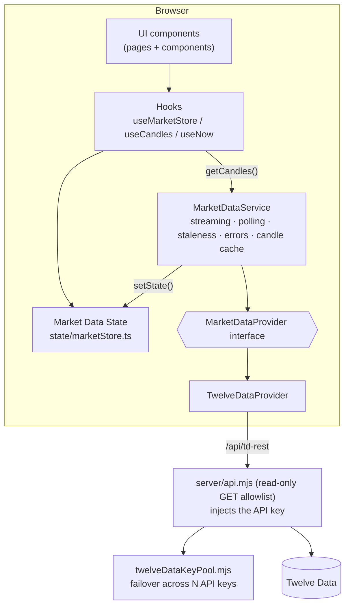
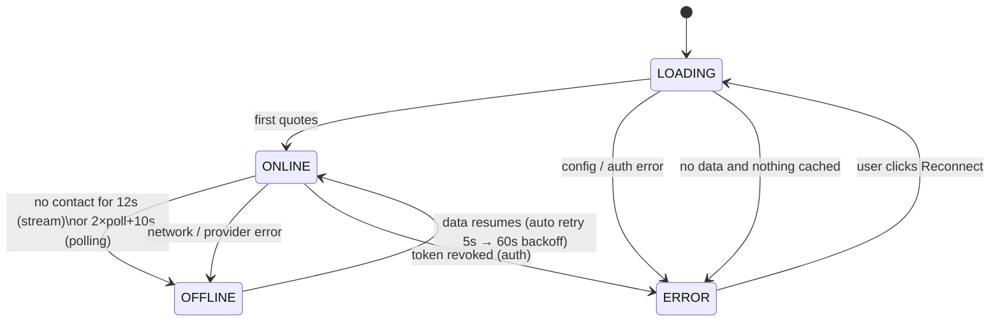
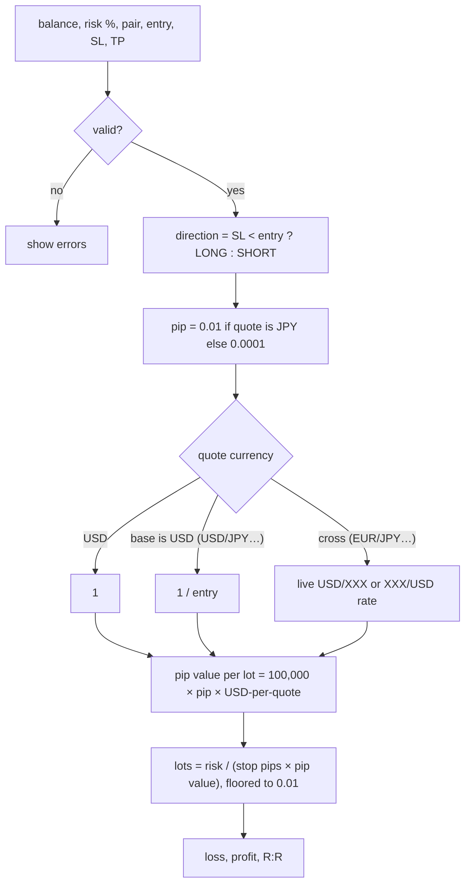
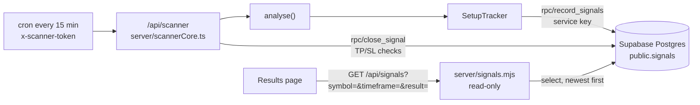
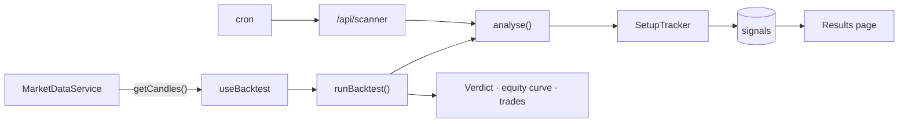

# Ichialgo — Forex terminal

**Live Forex market data, a 24/7 server-side signal scanner, a backtest that replays the same
code the scanner runs, and an R-multiple results page.**

> **No strategy is currently installed.** Prices, charts, the scanner, the database and the
> backtest all run; nothing is being scored. See [§4](#4-strategy) for the one file that
> changes.

| Stack | |
|---|---|
| UI | React 19 + TypeScript, React Router 7 |
| Charts | TradingView Lightweight Charts v5 (open-source charting library) |
| Build | Vite 8 |
| Server | `server/api.mjs` read-only market-data proxy (used by dev, preview and `npm start`), with Twelve Data multi-key failover |
| Strategy | **none installed** — one seam at `src/services/strategy/analyse.ts` |
| Tests | Vitest — 234 across indicators, lifecycle, backtest, scanner, proxy, calculator |
| Data | Twelve Data, behind a provider interface |

---

## 1. Quick start

```bash
npm install
cp .env.example .env      # fill in ONE provider (see below)
npm run dev               # http://localhost:5173
npm test                  # calculator unit tests
npm run build             # typecheck + production bundle
npm start                 # production server: dist/ + proxy on http://127.0.0.1:8080
```

### Twelve Data keys

Twelve Data is the only provider. It is the one free forex source that serves intraday OHLC
candles **to a server, from any country, without a broker account** — OANDA is licensed per
country, Finnhub puts forex candles behind a paid plan, and Yahoo's unofficial endpoint blocks
datacenter IPs, so none of them work from a cloud host.

```
TWELVEDATA_API_KEY_1=key_from_account_1
TWELVEDATA_API_KEY_2=key_from_account_2
TWELVEDATA_API_KEY_3=key_from_account_3
TWELVEDATA_API_KEY_4=key_from_account_4
TWELVEDATA_API_KEY_5=key_from_account_5
```

One key per Twelve Data account; the numbering is the **failover order**. `TWELVEDATA_API_KEYS`
(comma-separated) and a single `TWELVEDATA_API_KEY` also work and can be mixed — see
`server/twelveDataKeyPool.mjs`.

#### The budget, and what more keys buy you

Free Basic is **8 credits/min and 800 credits/day PER KEY**, and `/quote` costs **1 credit per
symbol** — so a 7-pair refresh spends 7 credits. Candles (charts + the strategy) come out of the
same budget.

| Keys | Credits/min | Credits/day | Warm-up | Runtime/day at 60s polling |
|---|---|---|---|---|
| 1 | 8 | 800 | several minutes | ~1 h |
| 3 | 24 | 2400 | ~46 s | ~2.9 h |
| 5 | 40 | 4000 | ~46 s | **~4.8 h** |

Past ~3 keys the per-minute limit stops being the constraint and the **daily cap** becomes it.
More keys buy runtime, not speed. To trade speed for runtime, change one number:

| `VITE_TWELVEDATA_POLL_MS` | Credits/hour | 5 keys (4000/day) |
|---|---|---|
| `30000` (30 s) | ~1680 | ~2.4 h |
| `60000` (1 min, default) | ~840 | ~4.8 h |
| `120000` (2 min) | ~420 | ~9.5 h |
| `300000` (5 min) | ~168 | ~24 h |

(Quotes are 7 credits per refresh; candles cost roughly the same again.)

Check the pool any time at **`/api/td-rest/_status`** — key count, credits used today and each
key's state, with the keys masked to their last 4 characters.

> **Restart `npm run dev` after editing `.env`.** The keys have no `VITE_` prefix, so they stay in
> the Node proxy and are never bundled into browser code.

### Security: the proxy is read-only
`server/api.mjs` forwards only an allowlist of **GET** endpoints (`quote`, `time_series`, and the
local `_status` report). Everything else gets `403`/`405`, and any non-GET method gets `405`.
Keeping it read-only and explicit means a bug here cannot turn the proxy into a general-purpose
relay, and your API keys never leave the server.
`npm start` binds to `127.0.0.1`. Don't expose it publicly without authentication in front.

### Why not TradingView for data?
TradingView does not offer a public market-data API for this. We use their **open-source chart library**
for rendering and a real Forex provider for data.

---

## 2. Architecture



Rules enforced by the structure:

- UI **never** imports a provider. It reads `marketStore` and calls `marketDataService`.
- Provider-specific code lives only in `services/marketData/providers/`.
- The factory `providers/index.ts` is the only file that knows concrete providers.

### Folder map

```
src/
  config/        pairs.ts (add pairs here), timeframes.ts, app.ts, strategy.ts
  services/marketData/
    types.ts                 provider contract, Quote, Candle, ProviderError
    http.ts                  fetch + timeout + HTTP→error mapping
    MarketDataService.ts     orchestration (the heart of the data layer)
    providers/               TwelveDataProvider, creditBudget, factory
    index.ts                 singleton + public exports
  services/strategy/
    analyse.ts               THE SEAM — the strategy goes here (stub: always NO_TRADE)
    contract.ts              StrategyAnalysis, the types every consumer reads
    lifecycle.ts             SetupTracker: turns states into events (pure, tested)
    backtest.ts              replays candles through analyse() (pure, tested)
    performance.ts           R-multiple metrics, shared with live results (tested)
  state/marketStore.ts       immutable external store (useSyncExternalStore)
  state/accountStore.ts      balance + risk %, persisted; shared by plans and calculator
  hooks/                     useMarketData, useCandles, useChartIndicators,
                             useSignalStorage, useBacktest, useNow
  lib/indicators/            ema, atr, ichimoku (+tests)
  lib/                       positionSize (+tests), pips, format, time, locale
  components/                Navbar, MetricCard, ForexTable, ForexRow, MarketStatus,
                             PriceChange, PairDetails, CandlestickChart, TimeframeSelector,
                             EmptyState, BacktestPanel, BacktestResults, EquityCurve,
                             Calculator, ConnectionBanner, KumoMark, ScannerStatus
  components/chart/          kumoPrimitive (the Kumo fill)
  pages/                     Dashboard, PairPage, Results, Backtest, CalculatorPage
server/
  api.mjs                    read-only GET allowlist + Twelve Data key failover
  twelveDataKeyPool.mjs      multi-key credit pool (+ tests next to it)
  index.mjs                  production server (dist/ + the same proxy)
api/                         Vercel entry points wrapping server/api.mjs
```

---

## 3. How live data flows

```mermaid
sequenceDiagram
    participant App
    participant Svc as MarketDataService
    participant P as Provider
    participant S as marketStore
    participant UI as ForexRow (×7)

    App->>Svc: start()
    Svc->>S: status = LOADING
    Svc->>P: assertConfigured()
    alt missing / rejected credentials
        P-->>Svc: ProviderError(config | auth)
        Svc->>S: status = ERROR (halt until Reconnect)
    end
    Svc->>P: getQuotes(7 pairs)  (initial snapshot)
    P-->>Svc: { quotes, failed }
    Svc->>S: quotes, status = ONLINE
    S-->>UI: each row re-renders only for its own symbol
    else polling (Twelve Data)
        loop every pollIntervalMs
            Svc->>P: getQuotes()
        end
    end
```

### Connection state machine



**Stale data is never shown as live.** When status is not `ONLINE`, rows are dimmed and tagged
`STALE`, the header shows `● MARKET DATA OFFLINE`, and a banner explains why.
Weekend closures are different: the connection stays `ONLINE` and rows show `CLOSED`.

### Error handling matrix

| Error kind | Example | What the service does | What the user sees |
|---|---|---|---|
| `config` | proxy not running, bad account id | halt | red banner + fix instructions + Reconnect |
| `auth` | 401/403 | halt | "Twelve Data rejected the API key…" |
| `rate_limit` | 429 / Twelve Data credits | wait `Retry-After` (default 60s) | banner with countdown; OFFLINE if data ages out |
| `network` | timeout, stream stalled | exponential backoff 5s→60s, stream re-open 15s→5min | OFFLINE + STALE rows |
| `invalid_symbol` | pair not offered | drop that pair only | row tagged UNAVAILABLE |
| `no_data` | empty response | retry | ERROR/OFFLINE banner |

### Streaming (not used today)

`MarketDataService` can drive a push stream and fall back to polling when it dies, but Twelve
Data's WebSocket needs a Pro plan, so `capabilities.streaming` is `false` and the app polls.
The plumbing is kept because adding streaming later means implementing `subscribe()` on the
provider and nothing else.

### Candles

`useCandles(symbol, timeframe)` loads 300 candles, refreshes every `candleRefreshMs`
(≥120s on Twelve Data), and patches the **forming** candle's high/low/close with live ticks.
It never creates bars. `CandlestickChart` calls `series.update()` for small changes (keeps the user's zoom)
and `setData()` when the pair or timeframe changes.

**24H change**
Twelve Data's own `percent_change`, measured against the previous daily close — the column header
tooltip says so. There is no bid/ask on the REST quote, so those columns show `—`.

---

## 4. Strategy

**There is no strategy installed.** This is deliberate, and it is the current state of the
repository, not an omission.

Two engines used to live here — an EMA50-touch detector driving the dashboard, and an
Ichimoku + EMA50 confluence engine driving the 24/7 scanner. They shared no decision code, so
the dashboard advertised setups the scanner would never act on, and neither could be removed
because every consumer had grown a dependency on one or the other. Both are gone.

### The seam

Everything a strategy needs is built, tested and waiting. One file has to change.

```
candles ──▶ analyse() ──▶ StrategyAnalysis ──┬──▶ SetupTracker  is this news?
               ▲                             ├──▶ scanner       record it
               │                             ├──▶ backtest      replay it
      src/services/strategy/analyse.ts       └──▶ UI            show it
```

| File | Role |
|---|---|
| `strategy/analyse.ts` | **the seam.** Returns `NO_TRADE` for everything. Replace this. |
| `strategy/contract.ts` | the types every consumer reads. Strategy-neutral by design. |
| `strategy/lifecycle.ts` | turns a stream of states into a stream of events. Plumbing. |
| `strategy/backtest.ts` | replays candles through the same `analyse()` the scanner calls. |
| `strategy/performance.ts` | R-multiple metrics, shared by the backtest and live results. |
| `lib/indicators/` | Ichimoku, EMA, ATR, market structure. Pure, tested, no opinion. |

Nothing outside `src/services/strategy/` imports anything deeper than the barrel. That is what
makes the strategy replaceable without touching the scanner, the backtest or the UI.

### The contract

`analyse()` returns a `StrategyAnalysis` on **every** path, including refusals. Four rules:

1. **Never throw.** The scanner runs unattended every fifteen minutes; a throw is an error in a
   log nobody reads, while a `NO_TRADE` carrying a reason appears in the dry-run output and on
   the dashboard.
2. **Never report `CONFIRMED` on an unclosed bar.** The rejection you think you see can still be
   erased before the candle closes.
3. **Put strategy-specific values in `detail`.** It is stored verbatim as the `analysis` JSON
   column and nothing outside the strategy reads it, so it costs nothing and makes every
   decision auditable afterwards.
4. **Set `anchor`** to whatever identifies *this* setup — usually the price the move started
   from. The tracker uses it to tell a genuinely new opportunity from the same one still
   developing. Get it wrong and you either re-signal every candle or go silent.

### What the plumbing guarantees, whatever the rules are

- **One position per pair.** An `ACTIVE` setup suppresses every signal for its pair until its
  trade closes — and the tracker is released when it does, which is the difference between
  working correctly and going permanently silent while looking healthy.
- **A signal is an event, not a state.** Emitted on *entering* `CONFIRMED`, never while sitting
  in it. A confidence wobble below `upgradeDelta` is not news.
- **Cold-start safety.** Tracker state is persisted to `setup_state` and rehydrated, because a
  serverless scanner starts with an empty Map every single run.
- **Backtest and live cannot diverge.** Both call the same `analyse()`. There is no "backtest
  version" of the rules.
- **The backtest errs against you.** When one bar covers both the stop and a target, OHLC cannot
  order them, so the stop is taken. R is always measured against the *original* stop, never one
  moved to breakeven.

### Verifying a strategy once installed

```bash
curl -sS -H 'x-scanner-token: TOKEN' \
  'https://<your-app>/api/scanner?dry=EUR/USD&tf=4H'
```

Writes nothing; returns the full analysis for one pair including `reasons` and `warnings` —
which is how you find out *why* a pair is or is not signalling, rather than guessing.


## 5. Position-size calculator

Pure functions in `src/lib/positionSize.ts`, tested in `positionSize.test.ts`. Account currency is USD.



Worked example (unit test): USD/JPY at 150.00, stop 150.50, $10,000, 1% risk
→ 50 pips, pip value $6.67/lot, **0.30 lots**.

---

## 6. Signal history (database)

Every signal the scanner produces is written to Postgres, so the record survives a page reload,
a redeploy and a browser change. The **Results** page reads it back.

The browser never writes. Signals come from the server-side scanner alone — an earlier version
also computed them in the browser and posted them, which gave the app two sources of truth that
could disagree.

### The shape of it



The browser never talks to Supabase. It posts to our own proxy, which holds the **service key**
server-side — the same rule as the market-data keys. The table has RLS enabled with **no
policies**, so the anon key cannot read or write it even if it leaks; only the service role gets
through.

### Why an upsert, and why signals change

A touch is first seen while its bar is still forming (`outcome: 'pending'`, `source: 'live'`) and
is re-examined once the bar closes, when it becomes a bounce, a cross or inside. So the same
signal is sent more than once with better information. `upsert_signals` merges on the signal id:

```sql
where s.source = 'live' or s.outcome = 'pending'   -- only overwrite a provisional row
detected_at = least(s.detected_at, excluded.detected_at)  -- keep the first sighting
```

A confirmed row is never downgraded by a later live one, and the timestamp stays the moment the
touch was first seen. Client-side, `signalVersion = id|source|outcome` decides what to re-send:
a signal whose outcome changed gets a new version, so it goes up again; an unchanged one doesn't.

### Setup

Three environment variables, server-side only:

```
SUPABASE_URL=https://<project-ref>.supabase.co
SUPABASE_SERVICE_KEY=<service_role key from Project Settings → API>
SCANNER_TOKEN=<any long random string you invent>
```

`SUPABASE_SERVICE_KEY` is the **service_role** key, not the anon/publishable one. It bypasses RLS,
so it belongs only in the server environment — never in `VITE_*`, never in the bundle.

`SCANNER_TOKEN` is what stops anyone who finds the URL from triggering a scan. The cron service
sends it as the **`x-scanner-token`** header; `/api/signals` is read-only and needs no token.

Vercel binds environment variables to a **deployment**, so changing this in the dashboard does
not affect the deployment already running — redeploy, or the function keeps comparing against
the old value. A `401` from `/api/scanner` reports `headerPresent` and `lengthMatch` so you can
tell "no header sent" from "trailing newline" from "genuinely a different secret".

Apply `supabase/migrations/` to the project (Supabase SQL editor, or `supabase db push`) to create
the table and the RPC.

**Without these variables the app still works.** `/api/signals` answers `503` with
`{"configured": false}` and the Results page explains what is missing instead of erroring.

### Table

| column | notes |
|---|---|
| `id` | the app's own signal id — `strategy\|symbol\|timeframe\|barTime`, which is what makes the upsert idempotent |
| `symbol`, `timeframe`, `bar_time`, `detected_at` | when and what |
| `source` | `candle` (a closed bar) or `live` (a forming one) |
| `outcome` | `pending` · `bounce` · `cross` · `inside` |
| `approach`, `trend`, `bias` | direction of the touch and the EMA50 slope |
| `ichimoku` (jsonb), `ichimoku_score` | the five checks, and how many passed |
| `plan` (jsonb) | entry, ATR stop, 2R target, lot size |

`toRow()` in `server/signals.mjs` validates every field against the same CHECK constraints the
table enforces and **drops** a bad row rather than failing the batch — one malformed signal
cannot block the rest. `historyQuery()` whitelists the filter columns and caps `limit` at 1000, so
the query string cannot be used to construct an arbitrary PostgREST request.

---

## 7. Extending

**Add a pair:** append to `EXTRA_SYMBOLS` in `src/config/pairs.ts`. Nothing else changes.

**Add a provider:** the interface is still there, so the UI, strategy and backtest need no changes.
1. Implement `MarketDataProvider` in `providers/MyProvider.ts` (map symbols, map errors to `ProviderError`).
2. Register it in `providers/index.ts` and add `'myprovider'` to `ProviderId`.
3. Add a read-only route for it in `server/api.mjs` (`routes` array).
4. **Create the serverless entry point** re-exporting `_lib/handler.mjs`, and get the SHAPE right:

   | The route your proxy serves | The file Vercel needs |
   |---|---|
   | `/api/<prefix>/something` | `api/<prefix>/[...path].js` |
   | `/api/<prefix>` (bare, params in the query) | `api/<prefix>.js` |

   A `[...path]` catch-all matches `/api/foo/bar` but **not** `/api/foo` — it needs at least one
   segment. Neither mistake fails locally, because Vite pipes every request through the shared
   middleware whatever is in `api/`. `server/api.routes.test.mjs` derives the required shape from
   the route regexes and fails if a route and its file disagree.


**Add a strategy:** replace the body of `src/services/strategy/analyse.ts`, honouring the four
rules in [§4](#4-strategy), and set `STRATEGY_ID` in `server/scannerCore.ts`. Nothing else
changes — the tracker, scanner, database, backtest and Results page are all strategy-agnostic,
and `analyse.test.ts` asserts the contract they depend on.



Both paths into `analyse()` are the point: the backtest and the live scanner cannot diverge,
because there is only one implementation to diverge from.

---

## 8. Production deployment

```bash
npm run build
npm start          # serves dist/ and the proxy; reads .env
```

`server/index.mjs` is a small Express server that uses the **same** proxy module as `npm run dev`.
Configure it with `PORT` and `HOST` in `.env`. Put HTTPS and authentication (nginx, Caddy, Cloudflare Access, a VPN) in front
before exposing it beyond your machine.

If you use your own reverse proxy instead, copy the **GET-only allowlist** from `server/api.mjs`.
Don't use a catch-all `/v3/` rule.

### Testing against a mock provider
`TWELVEDATA_REST_URL` overrides the upstream host, for local testing only. Point it at a mock
server that returns Twelve Data-shaped JSON to exercise LOADING, ONLINE, OFFLINE and ERROR states
offline — including credit exhaustion, which is otherwise awkward to reproduce on purpose.
