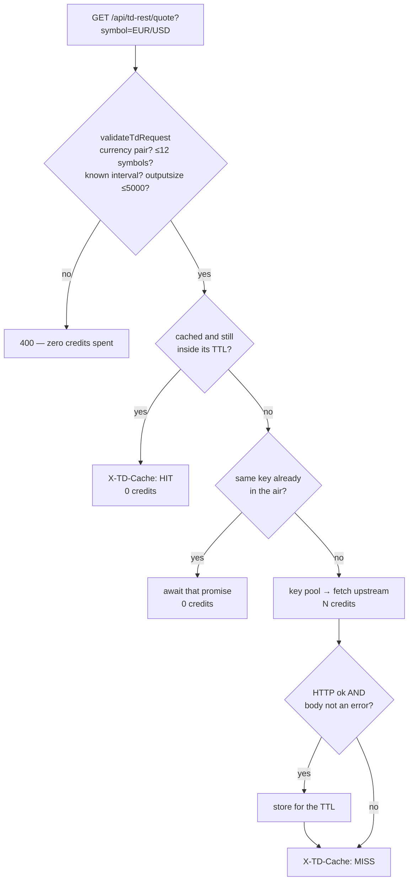
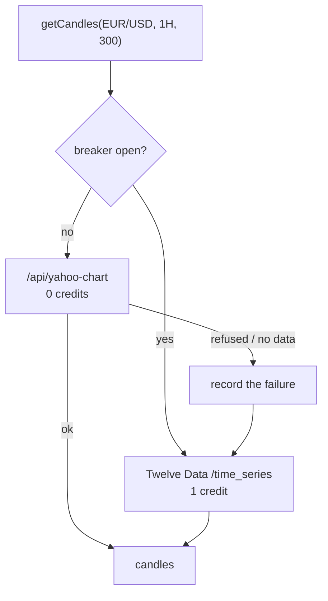
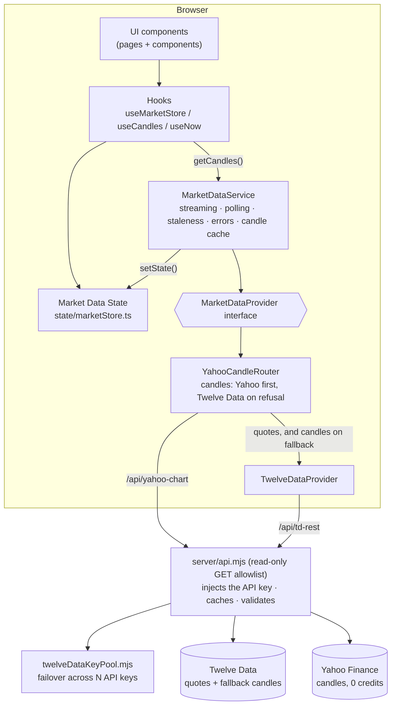
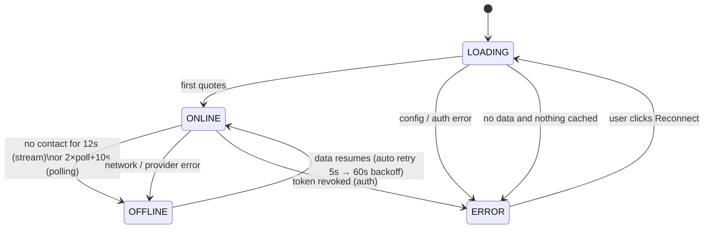
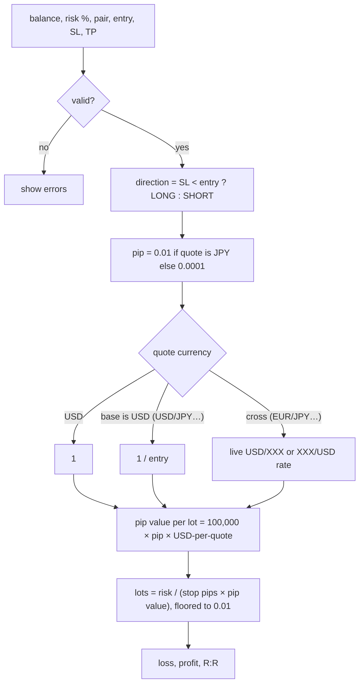

# Ichialgo — Forex terminal

**Live Forex market data, charts and a position-size calculator.**

> **No trading strategy.** One was built and removed — measured against real market data it had
> no edge. [§4](#4-strategy) records what happened and why, because the mistake is worth not
> repeating.

| Stack | |
|---|---|
| UI | React 19 + TypeScript, React Router 7 |
| Charts | TradingView Lightweight Charts v5 (open-source charting library) |
| Build | Vite 8 |
| Server | `server/api.mjs` read-only market-data proxy (used by dev, preview and `npm start`), with Twelve Data multi-key failover |
| Strategy | **none** — see [§4](#4-strategy) |
| Tests | Vitest — 156 across indicators, the proxy, the key pool, the response cache, the Yahoo candle route and the calculator |
| Data | Twelve Data, behind a provider interface |

---

## 1. Quick start

```bash
npm install
cp .env.example .env      # fill in ONE provider (see below)
npm run dev               # http://localhost:5173
npm test                  # calculator unit tests
npm run build             # typecheck + production bundle
npm start                 # production server: dist/ + proxy on http://127.0.0.1:8080
```

### Twelve Data keys

Twelve Data is the only provider. It is the one free forex source that serves intraday OHLC
candles **to a server, from any country, without a broker account** — OANDA is licensed per
country, Finnhub puts forex candles behind a paid plan, and Yahoo's unofficial endpoint blocks
datacenter IPs, so none of them work from a cloud host.

```
TWELVEDATA_API_KEY_1=key_from_account_1
TWELVEDATA_API_KEY_2=key_from_account_2
TWELVEDATA_API_KEY_3=key_from_account_3
TWELVEDATA_API_KEY_4=key_from_account_4
TWELVEDATA_API_KEY_5=key_from_account_5
```

One key per Twelve Data account; the numbering is the **failover order**. `TWELVEDATA_API_KEYS`
(comma-separated) and a single `TWELVEDATA_API_KEY` also work and can be mixed — see
`server/twelveDataKeyPool.mjs`.

#### The budget, and what more keys buy you

Free Basic is **8 credits/min and 800 credits/day PER KEY**, and `/quote` costs **1 credit per
symbol** — so a 7-pair refresh spends 7 credits. Chart candles come out of the same budget.

| Keys | Credits/min | Credits/day | Warm-up | Runtime/day at 60s polling |
|---|---|---|---|---|
| 1 | 8 | 800 | several minutes | ~1 h |
| 3 | 24 | 2400 | ~46 s | ~2.9 h |
| 5 | 40 | 4000 | ~46 s | **~4.8 h** |

Past ~3 keys the per-minute limit stops being the constraint and the **daily cap** becomes it.
More keys buy runtime, not speed. To trade speed for runtime, change one number:

| `VITE_TWELVEDATA_POLL_MS` | Credits/hour | 5 keys (4000/day) |
|---|---|---|
| `30000` (30 s) | ~1680 | ~2.4 h |
| `60000` (1 min, default) | ~840 | ~4.8 h |
| `120000` (2 min) | ~420 | ~9.5 h |
| `300000` (5 min) | ~168 | ~24 h |

(Quotes are 7 credits per refresh; candles cost roughly the same again.)

Check the pool any time at **`/api/td-rest/_status`** — key count, credits used today and each
key's state, with the keys masked to their last 4 characters.

> **Restart `npm run dev` after editing `.env`.** The keys have no `VITE_` prefix, so they stay in
> the Node proxy and are never bundled into browser code.

#### Background tabs do not spend credits

Polling suspends while the tab is hidden and takes one fresh reading when it comes back.

This matters more than it sounds. Seven pairs at the default 60-second interval spend ~420
credits an hour, so a single forgotten background tab exhausts a 4,000-credit daily budget in
under ten hours — and then every chart in the app fails on an exhausted key. The failure has no error of its own; it surfaces days later as "the data stopped working".

Streaming is deliberately left running: a websocket the provider is already pushing to costs
nothing per message, and tearing it down on every tab switch would trade a real reconnect for
an imaginary saving.

#### Repeat requests do not spend credits either

The proxy keeps successful responses in memory and serves repeats from there
(`server/responseCache.mjs`). A second tab, a reload, or two users on the same deployment asking
for the same quote in the same minute cost **one** credit between them, not one each.

| Shape | Default TTL | Env var | Why |
|---|---|---|---|
| `/quote` | 60 s | `TWELVEDATA_QUOTE_CACHE_MS` | prices move constantly |
| `/time_series` | 15 min | `TWELVEDATA_SERIES_CACHE_MS` | a 1h/4h bar only changes when it closes |

Set either to `0` to disable that half — useful for ten minutes of debugging, expensive to leave
off. Every response carries `X-TD-Cache: HIT|MISS`, so a credit question can be answered by
looking in devtools rather than guessing, and `/api/td-rest/_status` reports `cache.hits`,
`cache.misses` and `cache.entries`.

Two callers arriving together are the case a TTL alone does **not** cover: aligned pollers all
miss an empty cache in the same millisecond, so a plain TTL would let N tabs each start their own
upstream request. The cache therefore also does **single-flight** — the second caller joins the
request already in the air instead of starting a new one.



Errors are deliberately **not** cached. Caching one would turn a single bad minute into a whole
TTL of bad minutes, and an error is exactly what a caller should be free to retry.

Note the cache lives in the process, so on Vercel it is per warm instance and dies on a cold
start. That makes it weaker there than it is under `npm start`, not broken: the polling loop the
cache exists for hits the same warm instance repeatedly.

### Chart candles come from Yahoo, for free

A `/time_series` call costs a Twelve Data credit. Yahoo's chart endpoint costs
nothing and needs no account, so candles are taken from there first:



**Quotes stay on Twelve Data.** Yahoo was removed from this project once
already, for a real reason: the chart endpoint is unofficial and answers 429
to datacenter IPs, which is what a Vercel function is. Seven pairs polled
every 60 seconds forever from a serverless IP is exactly the traffic that
earns that refusal. Candles are a different shape of request — one per pair
per timeframe when a chart is opened, behind a 15-minute server cache — so
Yahoo is used as a **saving with a fallback, never as a dependency**.

The circuit breaker is what keeps a refusal cheap. Without it every chart
would pay a doomed round trip before falling back:

| What happened | What the breaker does |
|---|---|
| 429 (the datacenter-IP block) | park Yahoo for 30 min — it does not clear in a minute |
| any other failure, 1st or 2nd | nothing; one bad response is just one bad response |
| 3 failures in a row | park Yahoo for 5 min |
| a success | reset the count |

While parked, candles go straight to Twelve Data with no wasted request.

| Setting | Default | What it does |
|---|---|---|
| `VITE_YAHOO_CANDLES` | on | `0` goes back to Twelve Data for candles |
| `YAHOO_CACHE_MS` | `900000` | how long the proxy may reuse a Yahoo response |

Responses carry `X-Yahoo-Cache: HIT|MISS`, and `/api/td-rest/_status` reports
`yahooCache`. To see which source actually drew a chart, watch the network
tab: `/api/yahoo-chart` is free, `/api/td-rest/time_series` is a credit.

4H is the one timeframe Yahoo has no interval for, so it is **resampled from
1h bars** — exact, not approximate: four 1h bars tile a 4h bar perfectly.
They are bucketed on absolute UTC time (00:00, 04:00, 08:00…), which is not
necessarily where Twelve Data puts its own 4H bars, so a fallback refetches
the whole series rather than splicing two sources together.

### Security: the proxy is read-only
`server/api.mjs` forwards only an allowlist of **GET** endpoints (`quote`, `time_series`, and the
local `_status` report). Everything else gets `403`/`405`, and any non-GET method gets `405`.
Keeping it read-only and explicit means a bug here cannot turn the proxy into a general-purpose
relay, and your API keys never leave the server.
`npm start` binds to `127.0.0.1`. Don't expose it publicly without authentication in front.

Before any credit is committed, `server/tdValidate.mjs` also checks that the request is one we are
willing to **pay** for:

- the symbol is a currency pair — two ISO-4217 codes separated by `/` (a shape check, not a
  hard-coded list, so adding a pair to `src/config/pairs.ts` cannot silently break the proxy);
- at most 12 symbols per batch, because `/quote` charges per symbol;
- the interval is one Twelve Data actually supports;
- `outputsize` is a number and at most 5000.

A request that fails any of these gets `400` and costs **nothing**. Without this, anyone who found
the deployment could use it as their own free Twelve Data key — on your daily budget. The path
forwarded upstream is rebuilt from the validated parameters rather than patched, so nothing
unreviewed rides along.

### Why not TradingView for data?
TradingView does not offer a public market-data API for this. We use their **open-source chart library**
for rendering and a real Forex provider for data.

---

## 2. Architecture



Rules enforced by the structure:

- UI **never** imports a provider. It reads `marketStore` and calls `marketDataService`.
- Provider-specific code lives only in `services/marketData/providers/`.
- The factory `providers/index.ts` is the only file that knows concrete providers.

### Folder map

```
src/
  config/        pairs.ts (add pairs here), timeframes.ts, app.ts
  services/marketData/
    types.ts                 provider contract, Quote, Candle, ProviderError
    http.ts                  fetch + timeout + HTTP→error mapping
    MarketDataService.ts     orchestration (the heart of the data layer)
    providers/               TwelveDataProvider, creditBudget, factory
    providers/yahooCandles   free candles: symbol/range mapping, 4H resampling
    providers/YahooCandleRouter  Yahoo first, Twelve Data on refusal (+breaker)
    index.ts                 singleton + public exports
  state/marketStore.ts       immutable external store (useSyncExternalStore)
  state/accountStore.ts      balance + risk %, persisted; shared by plans and calculator
  hooks/                     useMarketData, useCandles, useChartIndicators, useNow
  lib/indicators/            ema, atr, ichimoku (+tests)
  lib/                       positionSize (+tests), pips, format, time, locale
  components/                Navbar, MetricCard, ForexTable, ForexRow, MarketStatus,
                             PriceChange, PairDetails, CandlestickChart, TimeframeSelector,
                             EmptyState, Calculator, ConnectionBanner, KumoMark
  components/chart/          kumoPrimitive (the Kumo fill)
  pages/                     Dashboard, PairPage, CalculatorPage
fixtures/market/             real OANDA candles, for validating any future strategy
server/
  api.mjs                    read-only GET allowlist + Twelve Data key failover
  tdValidate.mjs             request guard: currency pairs only, batch + outputsize caps
  yahoo.mjs                  Yahoo chart allowlist (free candles, no account)
  responseCache.mjs          TTL cache + single-flight, so repeats cost no credits
  twelveDataKeyPool.mjs      multi-key credit pool (+ tests next to it)
  index.mjs                  production server (dist/ + the same proxy)
api/                         Vercel entry points wrapping server/api.mjs
```

---

## 3. How live data flows

```mermaid
sequenceDiagram
    participant App
    participant Svc as MarketDataService
    participant P as Provider
    participant S as marketStore
    participant UI as ForexRow (×7)

    App->>Svc: start()
    Svc->>S: status = LOADING
    Svc->>P: assertConfigured()
    alt missing / rejected credentials
        P-->>Svc: ProviderError(config | auth)
        Svc->>S: status = ERROR (halt until Reconnect)
    end
    Svc->>P: getQuotes(7 pairs)  (initial snapshot)
    P-->>Svc: { quotes, failed }
    Svc->>S: quotes, status = ONLINE
    S-->>UI: each row re-renders only for its own symbol
    else polling (Twelve Data)
        loop every pollIntervalMs
            Svc->>P: getQuotes()
        end
    end
```

### Connection state machine



**Stale data is never shown as live.** When status is not `ONLINE`, rows are dimmed and tagged
`STALE`, the header shows `● MARKET DATA OFFLINE`, and a banner explains why.
Weekend closures are different: the connection stays `ONLINE` and rows show `CLOSED`.

### Error handling matrix

| Error kind | Example | What the service does | What the user sees |
|---|---|---|---|
| `config` | proxy not running, bad account id | halt | red banner + fix instructions + Reconnect |
| `auth` | 401/403 | halt | "Twelve Data rejected the API key…" |
| `rate_limit` | 429 / Twelve Data credits | wait `Retry-After` (default 60s) | banner with countdown; OFFLINE if data ages out |
| `network` | timeout, stream stalled | exponential backoff 5s→60s, stream re-open 15s→5min | OFFLINE + STALE rows |
| `invalid_symbol` | pair not offered | drop that pair only | row tagged UNAVAILABLE |
| `no_data` | empty response | retry | ERROR/OFFLINE banner |

### Streaming (not used today)

`MarketDataService` can drive a push stream and fall back to polling when it dies, but Twelve
Data's WebSocket needs a Pro plan, so `capabilities.streaming` is `false` and the app polls.
The plumbing is kept because adding streaming later means implementing `subscribe()` on the
provider and nothing else.

### Candles

`useCandles(symbol, timeframe)` loads 300 candles, refreshes every `candleRefreshMs`
(≥120s on Twelve Data), and patches the **forming** candle's high/low/close with live ticks.
It never creates bars. `CandlestickChart` calls `series.update()` for small changes (keeps the user's zoom)
and `setData()` when the pair or timeframe changes.

**24H change**
Twelve Data's own `percent_change`, measured against the previous daily close — the column header
tooltip says so. There is no bid/ask on the REST quote, so those columns show `—`.

---

## 4. Strategy

**There is none.** The signal engine, the 24/7 scanner and everything that
stored or displayed their output were removed.

### Why, and what it cost

Two strategies were built here. Both were validated against a synthetic market
generator written alongside them — and that generator injected trends 45% of
the time, which flatters a trend-following strategy by construction. It
reported healthy numbers throughout: +0.39R a trade in "trending" conditions,
clean parameter sweeps, a tidy knee in the tuning curve. All of it measured
against a fiction.

When real OANDA data arrived (`fixtures/market/`, 6 pairs, 30,000 hourly
candles) the same engine returned:

```
172 trades      −0.097R per trade
win rate 30.8%  (34.1% needed at the observed 1.93:1 payoff)
95% CI          −0.308R to +0.113R      ← spans zero
```

No edge. Not catastrophically broken either — indistinguishable from a coin
flip, which is its own kind of answer.

### The lesson worth keeping

A generated market can establish that an engine is **causal** (it does not
read future bars), that its **tickets are coherent** (stop the right side of
entry, reward/risk as claimed), and that it **does not throw**. Those are real
and worth testing.

It cannot establish that a rule works. Using it for that produced three rounds
of tuning against noise, and every number reported along the way was wrong in
the same direction.

The fixtures are checked in so the next attempt can be measured properly from
its first line, and so that this mistake needs making only once.

### What survived

Everything under the strategy, because none of it depended on the rules being
good:

| Kept | Why |
|---|---|
| `lib/indicators/` | Ichimoku, EMA, market structure — pure maths, drawn on the chart |
| Market data layer | providers, service, store, key-pool proxy |
| UI | dashboard, pair charts, calculator |
| `fixtures/market/` | real candles to validate against |


## 5. Position-size calculator

Pure functions in `src/lib/positionSize.ts`, tested in `positionSize.test.ts`. Account currency is USD.



Worked example (unit test): USD/JPY at 150.00, stop 150.50, $10,000, 1% risk
→ 50 pips, pip value $6.67/lot, **0.30 lots**.

---

## 6. Signal history (removed)

The app no longer reads or writes signals, so `/api/signals`, the scanner and
the Supabase client are gone from the codebase.

The Postgres tables and their RPCs still exist in the project and are empty;
the migrations that created them remain in `supabase/migrations/` as history.
Nothing in the app touches them. Drop them, or leave them for whatever comes
next — they cost nothing idle.


## 7. Extending

**Add a pair:** append to `EXTRA_SYMBOLS` in `src/config/pairs.ts`. Nothing else changes.

**Add a provider:** the interface is still there, so the UI needs no changes.
1. Implement `MarketDataProvider` in `providers/MyProvider.ts` (map symbols, map errors to `ProviderError`).
2. Register it in `providers/index.ts` and add `'myprovider'` to `ProviderId`.
3. Add a read-only route for it in `server/api.mjs` (`routes` array).
4. **Create the serverless entry point** re-exporting `_lib/handler.mjs`, and get the SHAPE right:

   | The route your proxy serves | The file Vercel needs |
   |---|---|
   | `/api/<prefix>/something` | `api/<prefix>/[...path].js` |
   | `/api/<prefix>` (bare, params in the query) | `api/<prefix>.js` |

   A `[...path]` catch-all matches `/api/foo/bar` but **not** `/api/foo` — it needs at least one
   segment. Neither mistake fails locally, because Vite pipes every request through the shared
   middleware whatever is in `api/`. `server/api.routes.test.mjs` derives the required shape from
   the route regexes and fails if a route and its file disagree.


**Add a strategy:** there is no strategy layer any more, so this is a green field. Whatever goes
in, measure it against `fixtures/market/` before tuning a single threshold — [§4](#4-strategy)
records what happens otherwise.

---

## 8. Production deployment

```bash
npm run build
npm start          # serves dist/ and the proxy; reads .env
```

`server/index.mjs` is a small Express server that uses the **same** proxy module as `npm run dev`.
Configure it with `PORT` and `HOST` in `.env`. Put HTTPS and authentication (nginx, Caddy, Cloudflare Access, a VPN) in front
before exposing it beyond your machine.

If you use your own reverse proxy instead, copy the **GET-only allowlist** from `server/api.mjs`.
Don't use a catch-all `/v3/` rule.

### Testing against a mock provider
`TWELVEDATA_REST_URL` overrides the upstream host, for local testing only. Point it at a mock
server that returns Twelve Data-shaped JSON to exercise LOADING, ONLINE, OFFLINE and ERROR states
offline — including credit exhaustion, which is otherwise awkward to reproduce on purpose.
